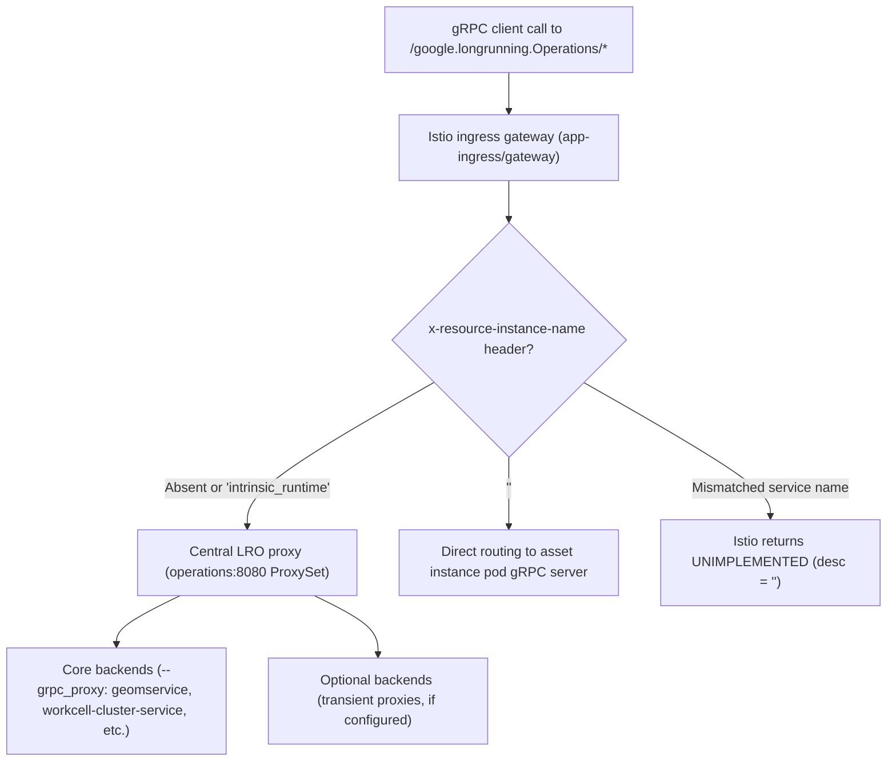

# Long-running operations proxy routing and polling

This reference covers `google.longrunning.Operations` proxy routing, Istio ingress header rules (`x-resource-instance-name`), backend operation implementations (Go, C++, Python), behavior tree executive operation lifecycles (`intrinsic_proto.executive.ExecutiveService`), System 2 reflection checkpoints, input-aware diagnostic decision trees, and multi-RPC polling sequences.

**Contents**:
- [Overview and service decision matrix](#overview-and-service-decision-matrix)
- [Istio ingress routing and `x-resource-instance-name` metadata headers](#istio-ingress-routing-and-x-resource-instance-name-metadata-headers)
- [Central proxy set dispatching (`ProxySet`) and backend implementations](#central-proxy-set-dispatching-proxyset-and-backend-implementations)
- [Behavior tree executive operation lifecycles (`ExecutiveService`) vs. cluster long-running operations (`LRO`)](#behavior-tree-executive-operation-lifecycles-executiveservice-vs-cluster-long-running-operations-lro)
- [System 2 reflection checkpoint before long-running operations](#system-2-reflection-checkpoint-before-long-running-operations)
- [Operational and diagnostic invariants](#operational-and-diagnostic-invariants)
- [Input-aware diagnostic decision trees](#input-aware-diagnostic-decision-trees)
- [Anti-thrashing circuit breakers](#anti-thrashing-circuit-breakers)
- [Contrastive bifurcation analysis (tau- / tau+)](#contrastive-bifurcation-analysis-tau---tau)
- [Multi-`RPC` polling sequences and metadata/response unpacking](#multi-rpc-polling-sequences-and-metadataresponse-unpacking)

## Overview and service decision matrix

The Intrinsic platform exposes a unified gRPC interface for managing asynchronous tasks via `google.longrunning.Operations` (`google.longrunning.Operations/GetOperation`, `google.longrunning.Operations/ListOperations`, `google.longrunning.Operations/CancelOperation`, `google.longrunning.Operations/DeleteOperation`, and `google.longrunning.Operations/WaitOperation`). Rather than persisting operation state in a centralized database, the cluster deploys a stateless proxy service (`operations:8080`) that aggregates and dispatches requests across independent backend gRPC servers, each maintaining its own in-memory operation map and worker queue.

| gRPC method (`google.longrunning.Operations/*`) | When to use | Routing behavior and backend mechanics |
| :--- | :--- | :--- |
| **`google.longrunning.Operations/GetOperation`** | Polling completion status, progress metadata (`metadata`), or final results (`response` / `error`) for any asynchronous operation. | Universal point-lookup RPC supported across all C++, Go, and Python backends. Required for C++ operations (`geomservice`, calibration) where `WaitOperation` is unimplemented. |
| **`google.longrunning.Operations/ListOperations`** | Discovering active or completed operations across cluster services or within a specific asset instance. | Fan-out aggregation RPC when routed via `operations:8080`. Requires an empty `ListOperationsRequest{}` to include C++ backends and avoid Go validation aborts. |
| **`google.longrunning.Operations/CancelOperation`** | Requesting cooperative cancellation of an in-progress asynchronous task. | Dispatches to the owning backend. Go and Python backends return `FAILED_PRECONDITION` if already `done`; C++ backends return `OK`. |
| **`google.longrunning.Operations/DeleteOperation`** | Removing completed or cancelled operation state from backend memory to prevent leaks. | Reclaims backend memory. On C++ backends, `GetOperation` (or `CancelOperation`) must be called to consume the future before calling `DeleteOperation`. |
| **`google.longrunning.Operations/WaitOperation`** | Blocking until completion or timeout on Go and Python backend operations. | Supported only by Go and Python backends. Unconditionally returns `UNIMPLEMENTED` on C++ backends (which `operations:8080` translates into `NOT_FOUND`). |

---

## Istio ingress routing and `x-resource-instance-name` metadata headers

Routing of `/google.longrunning.Operations/` calls at the cluster ingress gateway (`app-ingress/gateway`, reachable at `localhost:17080` externally or `istio-ingressgateway.app-ingress.svc.cluster.local:80` inside cluster pods) is governed by two sets of Istio `VirtualService` rules:

1. **Central LRO proxy routing (`operations` VirtualService)**: Matches any HTTP/2 gRPC request with URI prefix `/google.longrunning.Operations/` when the request **omits** `x-resource-instance-name` (`withoutHeaders: x-resource-instance-name: {}`) or **includes** `x-resource-instance-name: intrinsic_runtime`. Routes to `operations:8080`.
2. **Direct asset instance routing (`rs-<asset_name>` VirtualServices)**: Matches requests with `x-resource-instance-name: <custom_asset_instance>`, routing directly to that asset instance pod gRPC server.



---

## Central proxy set dispatching (`ProxySet`) and backend implementations

The central `operations:8080` proxy service constructs an ordered `ProxySet` from repeated command-line flag groups:
- `--grpc_proxy`: Core platform services expected to be continuously available (such as `geomservice:8080`, `workcell-cluster-service:9957`, `scene-object-import:8080`, `asset-deployment:8080`, `asset-artifacts-v1:8080`, and `solution-deployment-v1:8080`).
- `--transient_grpc_proxy`: Optional or on-demand services wrapped in a transient error-coercing client.

### Point lookup and mutation `RPC`s (`GetOperation`, `CancelOperation`, `DeleteOperation`, `WaitOperation`)

When a point lookup or mutation RPC arrives at `ProxySet`:
1. **Sequential probing**: The proxy iterates sequentially through its slice of backend clients (`--grpc_proxy` entries first, followed by `--transient_grpc_proxy` entries) without modifying the incoming request proto.
2. **First-match short-circuit**: If a backend returns `codes.OK`, `ProxySet` immediately returns that response to the caller and does not query remaining backends.
3. **Non-terminal error fallback**: If a backend returns `codes.NotFound` or `codes.Unimplemented`, `ProxySet` swallows the error and continues probing the next backend in the slice.
4. **Terminal error propagation (fail-fast)**: If any backend returns a status code other than `codes.OK`, `codes.NotFound`, or `codes.Unimplemented` (for example, `codes.InvalidArgument`, `codes.PermissionDenied`, `codes.FailedPrecondition`, or an unwrapped `codes.Unavailable` from a non-transient `--grpc_proxy` backend), `ProxySet` halts iteration immediately and propagates that error directly to the client.
5. **Exhaustion translation**: If all backends in the slice return `codes.NotFound` or `codes.Unimplemented`, `ProxySet` synthesizes and returns `codes.NotFound` (`Operation "<name>" not found`).

### Aggregation `RPC` (`ListOperations`)

When `google.longrunning.Operations/ListOperations` is called on `ProxySet`:
1. `ProxySet` iterates through all configured backend clients sequentially.
2. Any backend returning `codes.Unimplemented` is silently skipped.
3. Any backend returning another non-OK status code immediately fails the entire `ListOperations` request and returns that error to the client.
4. Every successful `ListOperationsResponse` is combined into a single response using `proto.Merge(mergedResponse, resp)`.

### Transient proxy error coercion (`transient_grpc_proxy`) and deployment realities

Optional services registered under `--transient_grpc_proxy` wrap the underlying `google.longrunning.Operations` client stub to intercept `codes.Unavailable` when an optional service is offline or scaled down:
- **`google.longrunning.Operations/ListOperations`**: Coerces `codes.Unavailable` into `codes.OK` with an empty `ListOperationsResponse{}`, allowing `ProxySet.ListOperations` to merge active backend results without failing.
- **`google.longrunning.Operations/GetOperation`, `CancelOperation`, `DeleteOperation`, `WaitOperation`**: Coerces `codes.Unavailable` into `codes.NotFound` so `ProxySet` treats the offline backend as a miss and continues probing subsequent backends.
- **Client channel initialization (C++)**: `CreateTransientGrpcProxy` initializes its gRPC channel directly via `grpc::CreateCustomChannel` rather than standard platform connection helpers, intentionally bypassing startup health-check and connection-wait loops so offline optional targets do not block proxy initialization.
- **Live Intrinsic Core deployment configuration**: In standard local workcell deployments, deployment patches (`drop-the-training-and-cas-preload-services.patch`) remove transient services (`train` and `onprem-cas-preload`). On live workcells, `operations:8080` runs with core `--grpc_proxy` backends only.

### Backend operation server implementations (`Go`, `C++`, `Python`)

Platform and asset backends implement `google.longrunning.Operations` using language-specific libraries that differ in RPC coverage and validation:

| Feature / RPC | Go backend implementation (`intrinsic/longrunning/go`) | C++ backend implementation (`OperationScheduler`) | Python backend implementation (`incode/longrunning/python`) |
| :--- | :--- | :--- | :--- |
| **Operation naming** | `{prefix}/{UUID}` convention; multi-port pods (such as `workcell-cluster-service`) can instantiate multiple independent operation maps on distinct ports (e.g. port `9957` for installed asset LROs). | Assigned per service scheduler; outbound proxy calls enforce a 30-second RPC deadline (`kServiceGrpcMaxDuration`). | Assigned per `Runner` / `OperationsServer` instance. |
| **`WaitOperation`** | **Supported**: Blocks until operation completes or `WaitOperationRequest.timeout` elapses. | **Unimplemented**: Unconditionally returns `UNIMPLEMENTED` (`"WaitOperation is not implemented"`). | **Supported**: Blocks until completion or timeout. |
| **`ListOperations` filtering** | Supports `done = true\|false` and `name = "<glob>"` joined by `AND`. Rejects non-empty `name` field with `INVALID_ARGUMENT`. | **Unimplemented**: Returns `UNIMPLEMENTED` if `name`, `filter`, `page_size`, or `page_token` is non-empty. | Rejects non-empty `name` with `INVALID_ARGUMENT`. Supports `done` and `name` filters; sorts by `create_time` descending. |
| **`CancelOperation`** | Returns `FAILED_PRECONDITION` if the operation is already marked `done`. | Returns `OK` even if the operation is already finished (leaving finished results intact). | Returns `FAILED_PRECONDITION` if called on a `done` operation. |
| **`DeleteOperation`** | Allowed on both running and finished operations (`OK`). | Rejects running operations with `INVALID_ARGUMENT`. Requires `GetOperation` (or `CancelOperation`) before deleting finished operations. | Allowed on any operation (`OK`). |

---

## Behavior tree executive operation lifecycles (`ExecutiveService`) vs. cluster long-running operations (`LRO`)

In addition to cluster-wide asynchronous tasks managed via `google.longrunning.Operations` (`operations:8080`), the platform manages behavior tree (BT) process execution through `intrinsic_proto.executive.ExecutiveService`. Agents should distinguish between these two operation surfaces:

| Dimension | Cluster LROs (`google.longrunning.Operations`) | Behavior tree executive operations (`intrinsic_proto.executive.ExecutiveService`) |
| :--- | :--- | :--- |
| **gRPC service & methods** | `google.longrunning.Operations/GetOperation`, `ListOperations`, `CancelOperation`, `DeleteOperation`, `WaitOperation` | `intrinsic_proto.executive.ExecutiveService/CreateOperation`, `GetOperation`, `ListOperations`, `StartOperation`, `ResumeOperation`, `PauseOperation`, `ResetOperation`, `CancelOperation`, `DeleteOperation` |
| **Protobuf message type** | `google.longrunning.Operation` (`name`, `done`, `metadata`, `response` / `error`) | `google.longrunning.Operation` (`name`, `done`, `metadata` unpacked to `intrinsic_proto.executive.RunMetadata`) |
| **Primary use case** | Asynchronous background jobs (geometry processing via `geomservice`, camera calibration, asset installation, solution deployment). | Stateful execution, pausing, stepping, resetting, and blackboard inspection of behavior trees and skills. |
| **World state initialization** | Operates on the target service's internal state. | `StartOperation` accepts `scene_id: "init_world"` (and `Run` accepts `start_from_world_state`) to clone the initial world state into the belief world and reset simulation before execution. |

---

## System 2 reflection checkpoint before long-running operations

Before dispatching an asynchronous operation or initiating a multi-RPC polling loop, complete the following pre-execution System 2 reflection checklist:
1. **Architecture check**: If C++ or unknown via central proxy: MUST poll `GetOperation`; do NOT use `WaitOperation`.
2. **Routing check**: Core service: omit `x-resource-instance-name` or set to `intrinsic_runtime`. Deployed asset: pass exact instance name.
3. **Payload schema check**: Verify protobuf types unpacking metadata and response (e.g. `GeometryProcessingResult`).
4. **Cleanup check**: If C++, call `GetOperation` or `CancelOperation` prior to `DeleteOperation`.
5. **Lock check**: Release all local/shared locks before entering sleep/polling loops to prevent deadlocks across conductor threads.

---

## Operational and diagnostic invariants

Adhere strictly to the following affirmative operational invariants. Each negative safety rule is paired with its required affirmative target action:

1. **Polling mechanism**: Never invoke `WaitOperation` when routing through the central `operations:8080` proxy or when targeting C++ backends. Always poll `google.longrunning.Operations/GetOperation` with non-blocking exponential backoff and explicit deadline timeout. Because C++ `OperationScheduler` returns `codes.Unimplemented` for `WaitOperation` and `ProxySet` treats unimplemented responses as a probe miss, calling `WaitOperation` on a C++ operation causes `ProxySet` to return `codes.NotFound` (`Operation "<name>" not found`).
2. **Lifecycle cleanup**: Never invoke `DeleteOperation` on an active C++ operation or before retrieving completed results. Always query `GetOperation` (or call `CancelOperation`) to consume the backend future prior to calling `DeleteOperation`. C++ `OperationScheduler::DeleteOperation` returns `codes.InvalidArgument` unless the operation was cancelled or its result has already been consumed via `GetOperation`.
3. **Cluster-wide listing**: Never populate `name`, `filter`, `page_size`, or `page_token` when calling `ListOperations` on the central proxy (`operations:8080`). Always send an empty `ListOperationsRequest{}` for cluster-wide discovery and filter operations client-side. Setting `name` causes Go backends to return `codes.InvalidArgument`, failing the entire query fast. Setting `filter` or `page_size` causes C++ backends to return `codes.Unimplemented`, silently omitting all C++ operations from the merged result.
4. **Ingress metadata routing**: Never attach custom or legacy service asset instance names to core runtime operations. Always omit `x-resource-instance-name` or set it to `exact: intrinsic_runtime` when targeting core runtime services, reserving custom instance names strictly for deployed service assets (`rs-<name>`). Attaching an unmatched instance name causes Istio to reject the RPC with an empty `UNIMPLEMENTED` status code.
5. **Lock holding during polling**: Never hold shared mutexes or cross-thread synchronization locks across synchronous long-running operation polling loops. Release all local locks before initiating polling loops and enforce independent per-call timeouts on client contexts to prevent system-wide control deadlocks.

---

## Input-aware diagnostic decision trees

Structure operational troubleshooting as input-aware conditional branches (`precondition -> diagnostic check -> targeted action`):

### Decision tree 1: operation point lookup and completion triage (`GetOperation` / `WaitOperation`)

- **Precondition**: `WaitOperation` through `operations:8080` returns `codes.NotFound` (`Operation "<name>" not found`) on an active operation.
  - *Diagnostic check*: Check if the target operation was created by a C++ service (e.g. `geomservice` or camera calibration).
  - *Targeted action*: Switch from `WaitOperation` to polling `GetOperation` with exponential backoff.
- **Precondition**: Calling `GetOperation` returns status code 12 (`UNIMPLEMENTED`) with an empty description (`desc = ""`).
  - *Diagnostic check*: Inspect client gRPC metadata headers for an invalid or legacy `x-resource-instance-name`.
  - *Targeted action*: For core runtime services (`operations`, `geomservice`, `world`), omit `x-resource-instance-name` or set it to `intrinsic_runtime`. For deployed service assets, confirm the instance name matches `kubectl get virtualservice -A`.
- **Precondition**: Polling loop reaches deadline without completion (`latest_op.done == false`).
  - *Diagnostic check*: Inspect backend pod health (`kubectl describe pod -l app=<service> -n app-intrinsic-base`).
  - *Targeted action*: Trigger cooperative cancellation via `CancelOperation(name)` and branch to alternative recovery path.

### Decision tree 2: operation discovery triage (`ListOperations`)

- **Precondition**: `ListOperations` fails immediately with `codes.InvalidArgument` (`name must not be specified`).
  - *Diagnostic check*: Check if `ListOperationsRequest.name` was set to a collection path or string.
  - *Targeted action*: Clear `ListOperationsRequest.name` to empty string `""` and reissue the request.
- **Precondition**: `ListOperations` succeeds but known active operations from C++ services (e.g. `geomservice`) are missing.
  - *Diagnostic check*: Check if `filter`, `page_size`, or `page_token` was passed in `ListOperationsRequest`.
  - *Targeted action*: Send an empty `ListOperationsRequest{}` and perform filtering and pagination client-side.

### Decision tree 3: operation deletion triage (`DeleteOperation`)

- **Precondition**: `DeleteOperation` fails with `codes.InvalidArgument` (`The Operation '<name>' is still running...`).
  - *Diagnostic check*: Check whether the operation is running on a C++ backend or completed without result retrieval.
  - *Targeted action*: If still running, call `CancelOperation` first. If completed, call `GetOperation` to consume the future, then reissue `DeleteOperation`.

### Decision tree 4: operation cancellation triage (`CancelOperation`)

- **Precondition**: `CancelOperation` fails with `codes.FailedPrecondition`.
  - *Diagnostic check*: Inspect `Operation.done` flag.
  - *Targeted action*: The operation already completed; treat cancellation as complete and proceed to retrieve results or clean up.

---

## Anti-thrashing circuit breakers

To prevent action thrashing, infinite busy-loops, and cascading client failures, enforce the following bounded execution caps:
1. **Polling frequency and backoff**: Begin polling with an initial interval of `0.2` seconds. Apply a multiplier of `1.5` up to a maximum interval of `2.0` seconds. Never execute tight busy-loops (`while not done: pass`) without sleep backoff.
2. **Bounded diagnostic checks**: Limit verification checks to <= 2-3 iterations when an operation fails to progress or returns unexpected non-terminal errors. If an operation fails with a terminal status code (`INVALID_ARGUMENT`, `PERMISSION_DENIED`, `FAILED_PRECONDITION`), halt polling immediately and escalate to diagnostic triage without retrying.
3. **Total operation deadline**: Enforce an absolute wall-clock timeout on all polling workflows (default `60.0` seconds for geometry operations, configurable per service). Upon timeout expiration, issue `CancelOperation` once and release client resources.

---

## Contrastive bifurcation analysis (tau- / tau+)

The following contrastive pairs illustrate the exact bifurcation points where failing operational trajectories diverged from succeeding ones:

| Operational domain | Failing trajectory (tau-) | Succeeding trajectory (tau+) | Bifurcation point invariant |
| :--- | :--- | :--- | :--- |
| **Operation polling strategy** | Calling `WaitOperation` on an operation owned by a C++ backend (`geomservice`, calibration) through `operations:8080`. `ProxySet` receives `codes.Unimplemented`, swallows it as a probe miss, and returns `codes.NotFound`. The client falsely assumes the operation was lost or deleted. | Polling `google.longrunning.Operations/GetOperation` with exponential backoff and explicit deadline. | Universal polling requires `GetOperation` across mixed backends; never call `WaitOperation` through the central proxy. |
| **Lifecycle cleanup and deletion** | Calling `DeleteOperation` on a C++ backend immediately after completion without calling `GetOperation` (or on a running operation). C++ `OperationScheduler` rejects deletion with `codes.InvalidArgument` because the underlying future was not consumed. | Calling `GetOperation` to retrieve the completed result (or calling `CancelOperation` first), then invoking `DeleteOperation`. | On C++ backends, `GetOperation` (or `CancelOperation`) must consume the future before `DeleteOperation` is permitted. |
| **Cluster-wide operation listing** | Calling `ListOperations` through `operations:8080` with a populated `filter` (`done = false`), `name`, or `page_size`. C++ `OperationScheduler` returns `codes.Unimplemented` (which `ProxySet` silently drops, omitting all C++ operations), or Go backends return `codes.InvalidArgument` (crashing the query fast). | Calling `ListOperations` with an empty `ListOperationsRequest{}` and filtering or paginating results client-side. | Central proxy aggregation requires an empty request proto to prevent silent C++ drops or Go fail-fast aborts. |
| **Ingress metadata routing** | Calling `/google.longrunning.Operations/` for a core runtime service while passing a custom or legacy header (e.g. `x-resource-instance-name: scene_object_import`). Istio rejects the non-matching request with an empty `UNIMPLEMENTED` (status code 12, `desc = ""`). | Omitting `x-resource-instance-name` or setting it to `exact: intrinsic_runtime` for core services, reserving custom instance names strictly for deployed service assets (`rs-<name>`). | Core platform runtime services require `intrinsic_runtime` or header omission; custom instance names are strictly for deployed service assets. |
| **Synchronization during polling** | Holding a module-wide or cross-thread mutex across a synchronous LRO polling loop (`while (!done) WaitOperation(...)`). Slow or stalled operations block the mutex indefinitely, deadlocking all other control endpoints. | Releasing shared locks before initiating polling loops, using non-blocking exponential sleep intervals, and enforcing independent client-side deadlines. | Never hold synchronization locks across network polling intervals. |

---

## Multi-`RPC` polling sequences and metadata/response unpacking

The following implementation provides a complete, portable Python client for managing long-running operations. It supports both Bazel workspaces (using `intrinsic.util.grpc.connection`) and standalone Python environments (using standard gRPC metadata tuples):

```python
import time
from typing import Type, TypeVar
from google.longrunning import operations_pb2
from google.longrunning import operations_pb2_grpc
from google.protobuf import message
import grpc

TResponse = TypeVar("TResponse", bound=message.Message)
TMetadata = TypeVar("TMetadata", bound=message.Message)


def create_operations_stub(
    address: str = "localhost:17080",
    asset_instance_name: str | None = None,
) -> tuple[operations_pb2_grpc.OperationsStub, list[tuple[str, str]]]:
  """Creates an OperationsStub with portable metadata routing.

  Args:
    address: Target gateway address (e.g. 'localhost:17080').
    asset_instance_name: Optional instance name for direct asset routing. If
      None, routes to the central LRO proxy (operations:8080).

  Returns:
    A tuple of (OperationsStub, call_metadata).
  """
  channel = grpc.insecure_channel(address)
  stub = operations_pb2_grpc.OperationsStub(channel)

  metadata: list[tuple[str, str]] = []
  if asset_instance_name is not None:
    # Route directly to the deployed asset instance
    metadata.append(("x-resource-instance-name", asset_instance_name))
  else:
    # Route to central cluster LRO proxy (omit header or use intrinsic_runtime)
    metadata.append(("x-resource-instance-name", "intrinsic_runtime"))

  return stub, metadata


def poll_operation_until_complete(
    ops_stub: operations_pb2_grpc.OperationsStub,
    operation_name: str,
    response_type: Type[TResponse],
    metadata_type: Type[TMetadata] | None = None,
    call_metadata: list[tuple[str, str]] | None = None,
    initial_poll_interval_sec: float = 0.2,
    max_poll_interval_sec: float = 2.0,
    backoff_multiplier: float = 1.5,
    timeout_sec: float = 60.0,
    max_consecutive_transient_retries: int = 3,
    delete_after_completion: bool = True,
) -> TResponse:
  """Polls GetOperation until done, unpacks response/metadata, and cleans up.

  Adheres to platform invariants:
  1. Polls GetOperation instead of calling WaitOperation to support C++ backends.
  2. Queries GetOperation before DeleteOperation to satisfy C++ preconditions.
  3. Enforces exponential backoff, anti-thrashing retries, and absolute timeout deadlines.

  Args:
    ops_stub: gRPC OperationsStub.
    operation_name: Fully qualified operation name.
    response_type: Expected protobuf response message class.
    metadata_type: Optional protobuf metadata message class for progress inspection.
    call_metadata: Optional gRPC metadata tuples for routing.
    initial_poll_interval_sec: Initial sleep duration between polls.
    max_poll_interval_sec: Maximum sleep duration between polls.
    backoff_multiplier: Exponential backoff factor.
    timeout_sec: Maximum total duration before raising TimeoutError.
    max_consecutive_transient_retries: Bounded retries for transient gRPC errors.
    delete_after_completion: If True, deletes operation state from backend memory.

  Returns:
    The unpacked protobuf response message.

  Raises:
    TimeoutError: If operation does not complete within timeout_sec.
    RuntimeError: If operation completes with an error status or returns empty.
    ValueError: If response unpacking fails.
  """
  deadline = time.monotonic() + timeout_sec
  current_interval = initial_poll_interval_sec
  consecutive_transient_errors = 0
  latest_op: operations_pb2.Operation | None = None

  while time.monotonic() < deadline:
    try:
      # Universal polling: GetOperation is supported across Go, C++, and Python
      latest_op = ops_stub.GetOperation(
          operations_pb2.GetOperationRequest(name=operation_name),
          metadata=call_metadata,
      )
      consecutive_transient_errors = 0
    except grpc.RpcError as e:
      # Anti-thrashing circuit breaker: retry transient failures up to cap
      if (
          hasattr(e, "code")
          and e.code() in (
              grpc.StatusCode.UNAVAILABLE,
              grpc.StatusCode.RESOURCE_EXHAUSTED,
              grpc.StatusCode.DEADLINE_EXCEEDED,
          )
          and consecutive_transient_errors < max_consecutive_transient_retries
      ):
        consecutive_transient_errors += 1
      else:
        # Re-raise terminal errors immediately (INVALID_ARGUMENT, PERMISSION_DENIED, etc.)
        raise

    if latest_op is not None:
      # Inspect intermediate progress metadata if requested
      if metadata_type is not None and latest_op.HasField("metadata"):
        if latest_op.metadata.Is(metadata_type.DESCRIPTOR):
          meta_instance = metadata_type()
          latest_op.metadata.Unpack(meta_instance)

      if latest_op.done:
        break

    time.sleep(current_interval)
    current_interval = min(
        current_interval * backoff_multiplier, max_poll_interval_sec
    )
  else:
    # Attempt cooperative cancellation on timeout before escalating
    try:
      ops_stub.CancelOperation(
          operations_pb2.CancelOperationRequest(name=operation_name),
          metadata=call_metadata,
      )
    except grpc.RpcError:
      pass
    raise TimeoutError(
        f"Operation {operation_name} did not complete within {timeout_sec}s."
    )

  if latest_op is None:
    raise RuntimeError(f"Operation {operation_name} returned no response.")

  # C++ precondition satisfied: GetOperation consumed the future above.
  # Delete from backend memory on completion regardless of status to prevent leaks.
  if delete_after_completion:
    try:
      ops_stub.DeleteOperation(
          operations_pb2.DeleteOperationRequest(name=operation_name),
          metadata=call_metadata,
      )
    except grpc.RpcError:
      # Log warning but do not drop successfully retrieved result
      pass

  # Check terminal status: error vs response
  if latest_op.HasField("error"):
    raise RuntimeError(
        f"Operation {operation_name} failed with code {latest_op.error.code}: "
        f"{latest_op.error.message}"
    )

  result = response_type()
  if latest_op.HasField("response"):
    if not latest_op.response.Unpack(result):
      raise ValueError(
          f"Failed to unpack {response_type.DESCRIPTOR.full_name} "
          f"from operation {operation_name}."
      )

  return result


def list_all_cluster_operations(
    ops_stub: operations_pb2_grpc.OperationsStub,
    call_metadata: list[tuple[str, str]] | None = None,
) -> list[operations_pb2.Operation]:
  """Lists operations across all Go, C++, and Python backends.

  Leaves name, filter, page_size, and page_token empty to prevent C++ backends
  from returning UNIMPLEMENTED (silent drop) and Go backends from returning
  INVALID_ARGUMENT (fail-fast abort).
  """
  resp = ops_stub.ListOperations(
      operations_pb2.ListOperationsRequest(),
      metadata=call_metadata,
  )
  return list(resp.operations)
```
