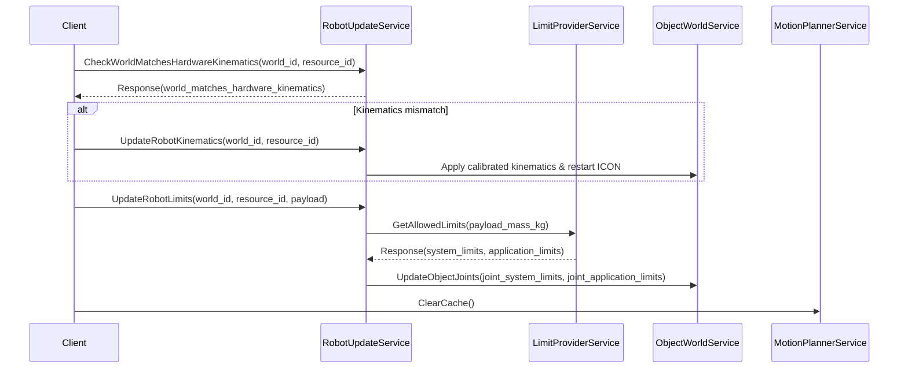

# World scene graph, spatial math primitives, and kinematics reference

This reference covers `intrinsic_proto.world.ObjectWorldService` scene graph hierarchies, multi-world lifecycles (`"world"`, `"init_world"`, `"sim_world"`, `"save_monitor"`, and cloned sandboxes), frame calibration (`intrinsic_proto.world.FrameCalibrationService`), kinematic skeletons (`intrinsic_proto.Skeleton`), dynamic limit checking modes, joint/rotational limits, 6-`DoF` dynamics protos, decision trees, reflection checkpoints, and circuit breakers.

---

## 1. Spatial math primitives cross-reference

### 1.1 Spatial primitive decision matrix and executive registry

For the canonical spatial math reference, decision matrix, and cross-language conversion rules (`intrinsic_proto.Pose`, `intrinsic_proto.Quaternion`, `intrinsic_proto.Transform`, `Pose3`, and `Rotation3`), consult [references/geometry-and-math.md](geometry-and-math.md).

Key platform invariants:
- **Explicit keyword arguments on `Pose3`**: Always construct `Pose3(rotation=rot, translation=[x, y, z])` with explicit keyword arguments (`rotation` first, `translation` second; `pose.vec7` orders translation first).
- **Unit quaternion initialization**: Always set `pose_proto.orientation.w = 1.0` on identity poses (`proto3` zero-initialized quaternions have norm `0.0` and fail validation). Ensure `abs(w^2 + x^2 + y^2 + z^2 - 1.0) < 1e-4`.
- **Executive well-known type registry**: Behavior tree executive skill parameter and return messages must use `intrinsic_proto.Pose` (never `intrinsic_proto.Transform`, which is not a registered well-known type in `intrinsic_proto.executive.ProtoBuilder`). Note that `ProtoBuilder` is an executive registry message type, not a separate gRPC service.

---

## 2. World scene graph, multi-world lifecycles, parent resolution, and multi-`RPC` sequences

### 2.1 Multi-world lifecycles (`"world"`, `"init_world"`, `"sim_world"`, `"save_monitor"`, `CloneWorld`, and `DeleteWorld`)

The platform separates runtime execution, persistent baseline state, unsaved modification tracking, and physics simulation across distinct named worlds in `intrinsic_proto.world.ObjectWorldService`:

| World identifier | Role and update frequency | When and why to use |
| :--- | :--- | :--- |
| **`"world"`** | Live belief world updated continuously at 20–33.3 Hz from hardware driver modules and sensors (valid named world IDs: `["sim_world", "world", "init_world", "save_monitor"]`; never pass invalid `"exec_world"` or `"belief"`). | Querying current kinematic poses (`GetTransform`, `GetObject`), updating perception target frames, or planning against the current workcell state. |
| **`"init_world"`** | Persistent workcell baseline stored on disk and restored whenever a solution resets. | Synchronizing calibrated frames or fixtures from `"world"` via `intrinsic_proto.world.ObjectWorldService/SyncObject` (`from_world_id="world"`, `to_world_id="init_world"`) so changes survive solution restarts. |
| **`"sim_world"`** | Active Gazebo physics simulation world. | Querying ground-truth simulator poses (`solution.simulator.get_transform`) or synchronizing passive kinematic joints (`intrinsic_proto.world.ObjectWorldService/UpdateWorld`). Live edits to `"world"` require calling `intrinsic_proto.simulation.v1.SimulationService/ResetSimulation` to reload static geometry into `"sim_world"`. |
| **`"save_monitor"`** | Internal tracking world maintained by the world service. | Monitoring unsaved modifications and delta properties against the persistent solution baseline. |
| **Cloned sandbox worlds** | Ephemeral isolated copies created via `intrinsic_proto.world.ObjectWorldService/CloneWorld`. | Sandboxing speculative IK, collision checks, or multi-step motion planning without mutating the live `"world"` belief state. |

- **API usage hints for `CloneWorld` and `DeleteWorld`**:
  - **`cloned_world_id` must be empty (`""`)**: When calling `intrinsic_proto.world.ObjectWorldService/CloneWorld` (`CloneWorldRequest`), the service rejects custom ID strings with `INVALID_ARGUMENT`. Always pass `cloned_world_id=""` and provide a descriptive prefix in `cloned_world_hint="planning_sandbox"`. The server assigns and returns the generated unique world metadata with its identifier in `clone_resp.id` (`WorldMetadata`).
  - **Always delete cloned worlds in a `try...finally` block**: Cloned worlds consume in-memory scene graphs and collision octrees on the world server. Always call `intrinsic_proto.world.ObjectWorldService/DeleteWorld` in a `finally` block to prevent memory leaks and server OOM.

```python
from intrinsic.world.proto import object_world_service_pb2
from intrinsic.world.proto import object_world_service_pb2_grpc


def run_in_cloned_planning_world(
    world_stub: object_world_service_pb2_grpc.ObjectWorldServiceStub,
    source_world_id: str = "world",
) -> None:
  """Clones a planning sandbox world and guarantees cleanup via DeleteWorld."""
  clone_resp = world_stub.CloneWorld(object_world_service_pb2.CloneWorldRequest(
      world_id=source_world_id, cloned_world_id="", cloned_world_hint="planning_sandbox"))
  try:
    pass  # Perform speculative kinematic updates or planning in clone_resp.id
  finally:
    world_stub.DeleteWorld(object_world_service_pb2.DeleteWorldRequest(world_id=clone_resp.id))
```

### 2.2 Scene graph hierarchy, non-neighboring `UpdateTransform` calls (`node_to_update`), and `ReparentObject`

- **Non-neighboring node transform updates require `node_to_update`**:
  - When calling `intrinsic_proto.world.ObjectWorldService/UpdateTransform` (`world.update_transform(node_a, node_b, a_t_b, node_to_update=...)`), if `node_a` and `node_b` are **non-neighboring nodes** in the kinematic tree (for example, setting `node_a = world.root` and `node_b = frame_node` when `frame_node` is attached to an intermediate object or link), you must explicitly pass `node_to_update = frame_node` (or the specific ancestor node whose local transform should absorb the delta). Omitting `node_to_update` on non-neighboring nodes fails with `INVALID_ARGUMENT`.
- **Object reparenting (`ReparentObject`) defaults to the stationary base link**:
  - Calling `intrinsic_proto.world.ObjectWorldService/ReparentObject` (`world.reparent_object(child_node, robot_node)`) where `new_parent` is a multi-link kinematic robot object attaches `child_node` to the robot's **stationary base link** by default.
  - To attach a grasped workpiece or tool to the moving robot end-effector, pass the flange or TCP frame (`world.get_frame("flange", "robot")`) as the target parent node or invoke `reparent_object_to_final_entity`.
- **Python SDK `world.get_frame(frame_name, object_name)` parameter order and `TransformNode` equality**:
  - In `ObjectWorldClient`, `world.get_frame(frame_name, object_name)` takes **`frame_name` first and `object_name` second** (for example, `world.get_frame("flange", "robot")`).
  - Always compare `TransformNode` instances by their `.id` string property (`node_a.id == node_b.id`) rather than Python object identity or equality (`node_a == node_b` raises `NotImplementedError`).

### 2.3 Relative frame transforms and persistence sequence (`GetTransform` -> compose in root frame -> `GetFrame` -> `UpdateTransform` -> `SyncObject`)

To apply a relative transform (such as a perception detection offset in a camera optical frame) to a frame in `ObjectWorldService` and persist it across solution resets:

1. **Query reference transform in root frame (`intrinsic_proto.world.ObjectWorldService/GetTransform`)**:
   Retrieve the transform from the workcell root (or parent object) to the sensor/source frame (`root_t_camera`).
2. **Compose pose in root frame**:
   Convert the relative detection (`camera_t_target`) into a `Pose3` and compose in the root frame (`root_t_target = root_t_camera.multiply(camera_t_target)`).
3. **Resolve direct parent node via `intrinsic_proto.world.ObjectWorldService/GetFrame` before `UpdateTransform`**:
   Calling `intrinsic_proto.world.ObjectWorldService/GetFrame` returns `intrinsic_proto.world.Frame` directly (there is no wrapper `GetFrameResponse`). Query `GetFrame` first and inspect `target_frame`:
   - If `target_frame.HasField("parent_frame")` and `target_frame.parent_frame.id` is non-empty, set `node_a.id = target_frame.parent_frame.id`.
   - Otherwise, set `node_a.id = target_frame.object.id` (the owning object's root node).
4. **Update transform (`intrinsic_proto.world.ObjectWorldService/UpdateTransform`)**:
   Set `node_a`, `node_b.id = frame_id`, `node_to_update.id = frame_id`, and `a_t_b` (computed relative to `node_a`).
5. **Synchronize object from `"world"` to `"init_world"` (`intrinsic_proto.world.ObjectWorldService/SyncObject`)**:
   Persist runtime frame updates to the persistent initial belief state by calling `intrinsic_proto.world.ObjectWorldService/SyncObject` with `from_world_id="world"` and `to_world_id="init_world"`.

```python
from intrinsic.math.proto import pose_pb2
from intrinsic.world.proto import object_world_refs_pb2
from intrinsic.world.proto import object_world_service_pb2
from intrinsic.world.proto import object_world_service_pb2_grpc
from intrinsic.world.proto import object_world_updates_pb2


def update_frame_pose_and_sync_to_init_world(
    world_stub: object_world_service_pb2_grpc.ObjectWorldServiceStub,
    world_id: str,
    frame_id: str,
    new_parent_t_frame: pose_pb2.Pose,
) -> None:
  """Resolves node_a via GetFrame, updates transform, and syncs to init_world."""
  target = world_stub.GetFrame(object_world_service_pb2.GetFrameRequest(
      world_id=world_id, frame=object_world_refs_pb2.FrameReference(id=frame_id)))
  parent_id = target.parent_frame.id if (target.HasField("parent_frame") and target.parent_frame.id) else target.object.id
  world_stub.UpdateTransform(object_world_updates_pb2.UpdateTransformRequest(
      world_id=world_id,
      node_a=object_world_refs_pb2.TransformNodeReference(id=parent_id),
      node_b=object_world_refs_pb2.TransformNodeReference(id=frame_id),
      a_t_b=new_parent_t_frame,
      node_to_update=object_world_refs_pb2.TransformNodeReference(id=frame_id)))
  world_stub.SyncObject(object_world_service_pb2.SyncObjectRequest(
      from_world_id=world_id, to_world_id="init_world", object=object_world_refs_pb2.ObjectReference(id=target.object.id)))
```

### 2.4 Why `ObjectView.FULL` is required on `GetObject` to populate `.entities` and child frames

- Calling `intrinsic_proto.world.ObjectWorldService/GetObject` with `view = ObjectView.BASIC` (or omitting `view`) returns a lightweight summary that omits the `.entities` map and detailed child entity frame descriptors.
- Attempting to resolve entity frame IDs, link frames, or slash-delimited TF paths (`asset_name/object_name/entity_name`, `object_name/entity_name`) from an object fetched with `ObjectView.BASIC` fails with `INVALID_ARGUMENT`. Always set `view = ObjectView.FULL` when inspecting child entities, links, or frames.

### 2.5 Multi-point geometric frame calibration (`intrinsic_proto.world.FrameCalibrationService`)

- **Platform level gating (`platform_level:enterprise`)**:
  - `intrinsic_proto.world.FrameCalibrationService` is gated behind `platform_level:enterprise` deployments and is **not deployed on `platform_level:core` workcells**.
- **Canonical core RPCs (`CalibrateTCP` and `CalibratePose`)**:
  - `intrinsic_proto.world.FrameCalibrationService/CalibrateTCP`: Computes tool center point (TCP) offset calibration via sphere-fitting across multiple probed flange poses (`repeated Pose base_ts_eoat = 1` in `CalibrateTCPRequest`, enforcing a minimum of 4 poses spanning diverse orientations around a common fixed point). Returns `Pose eoat_t_tcp = 2` (translational TCP offset w.r.t. EOAT reference with identity orientation) and `double error = 3` (residual fit error in meters) in `CalibrateTCPResponse`.
  - `intrinsic_proto.world.FrameCalibrationService/CalibratePose`: Computes a 3-point orthogonal right-handed coordinate frame pose (`Pose reference_t_frame = 2` in `CalibratePoseResponse`) from three probed points wrapped in `ThreePointPose three_point_pose = 1` inside `CalibratePoseRequest` (`reference_p_frame_origin`, `reference_p_frame_x_axis`, `reference_p_frame_x_y_plane` of type `intrinsic_proto.Point`). Points must be measured w.r.t. a common reference frame, separated by >= 10 mm (`norm(p1 - p2) >= 0.01`), and non-collinear.
  - Note: Canonical calibration RPCs are provided by `intrinsic_proto.world.FrameCalibrationService`.

To calibrate a workcell fixture coordinate frame from three probed robot TCP positions and persist the result in `ObjectWorldService`:

1. **Compute orthogonal frame pose (`intrinsic_proto.world.FrameCalibrationService/CalibratePose`)**:
   - Construct a `ThreePointPose` populating `reference_p_frame_origin`, `reference_p_frame_x_axis`, and `reference_p_frame_x_y_plane`, and wrap it in `CalibratePoseRequest(three_point_pose=...)`.
   - The service constructs an orthonormal right-handed rotation matrix from the origin-to-X vector and XY plane normal, returning the calibrated `intrinsic_proto.Pose` in `response.reference_t_frame`.
2. **Update and persist the calibrated frame in `ObjectWorldService` (`UpdateTransform` and `SyncObject`)**:
   - Pass the returned `intrinsic_proto.Pose` to `intrinsic_proto.world.ObjectWorldService/UpdateTransform` (or `CreateFrame`), then call `intrinsic_proto.world.ObjectWorldService/SyncObject` (`from_world_id="world"`, `to_world_id="init_world"`) so the calibrated pose survives solution resets.

```python
from intrinsic.math.proto import point_pb2
from intrinsic.math.proto import pose_pb2
from intrinsic.world.service.frame_calibration import frame_calibration_service_pb2
from intrinsic.world.service.frame_calibration import frame_calibration_service_pb2_grpc


def calibrate_frame_from_three_points(
    calib_stub: frame_calibration_service_pb2_grpc.FrameCalibrationServiceStub,
    origin: point_pb2.Point,
    x_axis_point: point_pb2.Point,
    xy_plane_point: point_pb2.Point,
) -> pose_pb2.Pose:
  """Computes a right-handed orthogonal Pose via CalibratePose."""
  resp = calib_stub.CalibratePose(frame_calibration_service_pb2.CalibratePoseRequest(
      three_point_pose=frame_calibration_service_pb2.ThreePointPose(
          reference_p_frame_origin=origin, reference_p_frame_x_axis=x_axis_point, reference_p_frame_x_y_plane=xy_plane_point)))
  return resp.reference_t_frame


def calibrate_tool_center_point(
    calib_stub: frame_calibration_service_pb2_grpc.FrameCalibrationServiceStub,
    flange_poses: list[pose_pb2.Pose],
) -> tuple[pose_pb2.Pose, float]:
  """Calibrates TCP offset from >= 4 probed end-of-arm tooling poses."""
  resp = calib_stub.CalibrateTCP(frame_calibration_service_pb2.CalibrateTCPRequest(base_ts_eoat=flange_poses))
  return resp.eoat_t_tcp, resp.error
```

### 2.6 Input-aware decision tree: scene graph updates and world persistence

Use this decision tree to select the appropriate spatial scene graph operation:

| Precondition | Diagnostic check | Targeted action |
| :--- | :--- | :--- |
| Need to update a frame attached to a direct parent node | Verify `node_a.id == parent_frame.id` or `object.id` via `GetFrame` | Call `UpdateTransform(node_a, node_b, a_t_b, node_to_update=node_b)`. |
| Need to update a frame relative to workcell root across multiple hierarchy levels | Target frame and reference node are non-neighboring in scene graph | Call `UpdateTransform(node_a=root, node_b=frame, a_t_b=..., node_to_update=frame)` with explicit `node_to_update`. |
| Grasping a workpiece with a robot end-effector | Part must follow robot flange motion rather than stationary base | Resolve flange frame via `get_frame("flange", "robot")` and call `reparent_object_to_final_entity(part, robot)` or `reparent_object(part, flange_frame)`. |
| Calibrated fixture or frame modified during runtime | Poses in `"world"` will be wiped on next solution reset | Call `SyncObject(from_world_id="world", to_world_id="init_world", object=...)` to persist changes to disk. |
| Sandboxing speculative IK or planning without mutating live belief state | Live `"world"` state must remain clean during speculative optimization | Call `CloneWorld(cloned_world_id="", cloned_world_hint="sandbox")` and wrap all operations in a `try...finally` block calling `DeleteWorld`. |
| Streaming external sensor or robot poses into world model | High-frequency 10–50 Hz transform updates | Publish `TFMessage` targeting root entity frame (`/object_name/base_link`) with strictly monotonically increasing timestamps (`header.stamp`). |

### 2.7 System 2 reflection checkpoint and anti-thrashing circuit breaker for scene graph operations

#### Pre-execution `System 2` reflection checkpoint
Before executing scene graph mutations or persistence calls (`UpdateTransform`, `ReparentObject`, `SyncObject`, `CloneWorld`):
1. **Frame hierarchy verification**: Did you verify whether `node_a` and `node_b` are direct parent-child neighbors? If non-neighboring, did you explicitly populate `node_to_update`?
2. **Parent target verification**: When reparenting to a robot, did you target the moving tool flange (`world.get_frame("flange", "robot")`) rather than the stationary robot base link?
3. **Persistence verification**: If this transform represents physical calibration or a permanent fixture offset, did you include `SyncObject(from_world_id="world", to_world_id="init_world")`?
4. **Sandbox cleanup verification**: If calling `CloneWorld`, is `DeleteWorld` guaranteed inside a `finally` block? Is `cloned_world_id` left empty (`""`)?
5. **Quaternion sanity**: Is orientation initialized with unit norm (`abs(w^2 + x^2 + y^2 + z^2 - 1.0) < 1e-4`)?

#### Anti-thrashing circuit breaker
- **Symptom**: `UpdateTransform` or `GetTransform` fails with `NOT_FOUND` or `INVALID_ARGUMENT`, or `/tf` state updates remain frozen.
- **Circuit breaker action**:
  - **Attempt 1**: Query `GetFrame` with `view = ObjectView.FULL` to inspect the live parent-child relationship and verify node IDs.
  - **Attempt 2**: Check `kubectl logs deploy/world` for `Skipping TF Message while world updater is paused` or `Update rejected ... robot last updated at ...`. If the world updater is paused, execute `inctl world reset --address=localhost:17080`.
  - **Breakout after 2 failed attempts**: Halt scene graph mutations. Branch to inspect cluster connectivity, verify world IDs (`["sim_world", "world", "init_world", "save_monitor"]`), and confirm external clock synchronization.

---

## 3. Kinematics, dynamic limit checking modes, and joint/rotational limits

### 3.1 Kinematic skeleton structure (`intrinsic_proto.Skeleton`, `intrinsic_proto.Joint`, `intrinsic_proto.Link`, `intrinsic_proto.CoordinateFrame`)

`intrinsic_proto.Skeleton` represents the complete kinematic and dynamic tree of a robot or articulated mechanism (`links`, `joints`, `coordinate_frames`, and `element_id_to_dof_index` mapping each movable joint's `Element.id` to its zero-based DoF index).

- **Fixed joints do not have DoF indices**: Only movable joints (`REVOLUTE` or `PRISMATIC`) appear in `element_id_to_dof_index`. `FIXED` joints have an `Element.id` in the kinematic tree and typically set unbounded `system_limits` and `soft_limits` (`1.7976931348623157e+308`), but have no entry in `element_id_to_dof_index`.
- **Strict structural invariants on `intrinsic_proto.Joint.LinearDependency`**:
  - Mechanical coupling (such as parallel-link mechanisms) is expressed via:
    `q_derived[i] = alpha_self * q_input[i] + sum(alpha_leading[k] * q_input[dof(k)])`
  - Every key in `alpha_leading` is a joint `Element.id` (not a zero-based DoF index).
  - A leading joint must strictly precede the dependent joint as an ancestor in the kinematic chain, must be a movable DoF, and cannot itself be a dependent joint (multi-stage dependent chains are rejected).
  - The resulting joint dependency matrix must be strictly lower triangular.
- **Symmetrical dynamic limits in `intrinsic_proto.Limits`**: Within `intrinsic_proto.Joint.Parameters`, `velocity`, `acceleration`, `jerk`, and `effort` are scalar `double` values representing symmetrical upper/lower bounds (`[-v_max, +v_max]`). Passing a negative scalar value fails deserialization validation.

### 3.2 Kinematics service and inverse kinematics commissioning (`intrinsic_proto.kinematics.KinematicsService`)

- `intrinsic_proto.kinematics.KinematicsService` and `intrinsic_proto.motion_planning.v1.MotionPlannerService` evaluate forward kinematics, Jacobians, and inverse kinematics against calibrated kinematic trees.
- When commissioning a physical robot or changing end-of-arm tooling (payload mass), synchronize the world model's kinematic skeleton and joint limits with the hardware controller before motion planning:
  1. Call `intrinsic_proto.world.RobotUpdateService/CheckWorldMatchesHardwareKinematics` with `world_id` and `resource_id`.
  2. If `world_matches_hardware_kinematics` is `false`, call `intrinsic_proto.world.RobotUpdateService/UpdateRobotKinematics` (which queries `intrinsic_proto.world.RobotCalibrationDataService/GetCalibrationData` on the hardware module, applies calibrated transforms, and restarts `ICON`).
  3. Call `intrinsic_proto.world.RobotUpdateService/UpdateRobotLimits` with `from_controller.payload_mass_kg` (which queries `intrinsic_proto.icon.LimitProviderService/GetAllowedLimits` and writes payload-adjusted limits to the world). Note that calling `UpdateRobotLimits` overwrites any custom `joint_application_limits` previously set on that robot.
  4. Call `intrinsic_proto.motion_planning.v1.MotionPlannerService/ClearCache` so subsequent planning calls do not return trajectories cached under old kinematics or limits.



### 3.3 Dynamic limits check mode (`intrinsic_proto.DynamicLimitsCheckMode`)

`intrinsic_proto.DynamicLimitsCheckMode` specifies which derivative limits a joint trajectory (`intrinsic_proto.icon.JointTrajectoryPVA.joint_dynamic_limits_check_mode`) guarantees to satisfy:
- `DYNAMIC_LIMITS_CHECK_MODE_TYPE_UNSPECIFIED` (`0`)
- `DYNAMIC_LIMITS_CHECK_MODE_CHECK_JOINT_ACCELERATION` (`1`): Enforces joint acceleration limits in addition to position and velocity limits.
- `DYNAMIC_LIMITS_CHECK_MODE_CHECK_NONE` (`2`): Bypasses joint acceleration limit checks; only joint position and velocity constraints are enforced.

- **API usage hint (concatenation equality check)**: When `intrinsic_proto.DynamicLimitsCheckMode` is deserialized into runtime trajectory objects, `DYNAMIC_LIMITS_CHECK_MODE_TYPE_UNSPECIFIED` (`0`) is mapped directly to `DYNAMIC_LIMITS_CHECK_MODE_CHECK_JOINT_ACCELERATION` (`1`). However, trajectory concatenation checks compare the raw protobuf enum values across all trajectory segments. Attempting to concatenate a segment with `DYNAMIC_LIMITS_CHECK_MODE_TYPE_UNSPECIFIED` (`0`) and a segment with explicit `DYNAMIC_LIMITS_CHECK_MODE_CHECK_JOINT_ACCELERATION` (`1`) fails with `InvalidArgumentError: All trajectory segments should have the same dynamic_limits_check_mode`. Always explicitly set `DYNAMIC_LIMITS_CHECK_MODE_CHECK_JOINT_ACCELERATION` or `DYNAMIC_LIMITS_CHECK_MODE_CHECK_NONE` on every trajectory segment.

### 3.4 Joint limit containers and updates (`intrinsic_proto.JointLimits`, `intrinsic_proto.JointLimitsUpdate`, `intrinsic_proto.JointLimitUpdate`)

- `intrinsic_proto.JointLimits`: Full joint limit specification across all DoFs (`RepeatedDouble` for `min_position`, `max_position`, `max_velocity`, `max_acceleration`, `max_jerk`, `max_effort`).
- `intrinsic_proto.JointLimitsUpdate`: Multi-DoF partial update message using `optional intrinsic_proto.RepeatedDouble` for each field (`intrinsic_proto.world.ObjectWorldService/UpdateObjectJoints`, `intrinsic_proto.icon.LimitProviderService/GetAllowedLimits`).
- `intrinsic_proto.JointLimitUpdate`: Single-DoF partial update message using scalar `optional double` fields (`intrinsic_proto.scene.v1.SceneService/UpdateJoints`).

- **API usage hints for joint limits**:
  - **All-or-nothing vector replacement in `JointLimitsUpdate`**: Any omitted or empty `RepeatedDouble` field leaves the base limit vector unchanged. Any non-empty `RepeatedDouble` field replaces the entire vector across all joints and must have the exact length of `num_dofs`. Passing a partial vector raises an `InvalidArgumentError`.
  - **Infinite values strip the entire derivative field**: When runtime `JointLimits` are serialized to protobuf, if *any* single joint's `max_velocity`, `max_acceleration`, `max_jerk`, or `max_effort` is `+infinity`, the serializer omits that entire `RepeatedDouble` field. Conversely, upon deserialization, any omitted optional field defaults to `+infinity` across *all* joints. Do not mix finite and infinite limits across joints within the same derivative order.
  - **`max_effort` is ignored by world updates**: In `intrinsic_proto.world.ObjectWorldService/UpdateObjectJoints`, `max_effort` is ignored, and `intrinsic_proto.world.ObjectWorldService/GetObject` populates `max_effort` with zeros in `joint_system_limits` and `joint_application_limits`.
  - **Distinct `JointLimitsUpdate` packages**: `intrinsic_proto.JointLimitsUpdate` (fields 1..6 including `max_effort`) is distinct from `intrinsic_proto.motion_planning.v1.JointLimitsUpdate` (fields 1..5 omitting `max_effort`, used inside `intrinsic_proto.motion_planning.v1.MotionSegment.joint_limits`).
  - **Effective limits precedence hierarchy**: The effective limit enforced by hardware controllers is the element-wise minimum (most conservative bound) of:
    1. Physical hardware `system_limits`
    2. Server/world `application_limits`
    3. Action-specific `joint_limits`

### 3.5 Rotational limits (`intrinsic_proto.RotationalLimits`)

`intrinsic_proto.RotationalLimits` (`min_rotation_angle`, `max_rotation_angle`, `reference_quaternion_for_min_max`) constrains Cartesian orientation inside `intrinsic_proto.icon.actions.proto.TaskSettings.rotational_limits`.
- **Axis-angle logarithmic vector in base frame (not Euler angles)**: The rotational offset is computed from the relative quaternion `q_rel = q_current * q_ref^-1` via the Lie algebra quaternion logarithm `theta = 2 * log(q_rel) in R^3`. Because `q_rel` right-multiplies by `q_ref^-1`, the components `(x, y, z)` of `min_rotation_angle` and `max_rotation_angle` bound the 3D axis-angle rotation vector expressed in the **base frame** (parent frame of the pose), not sequential Roll-Pitch-Yaw Euler angles around the local end-effector axes.
- **Mandatory unit quaternion and range checks**: Validation requires `min_rotation_angle[i] <= max_rotation_angle[i]` within `[-pi, +pi]` and requires `reference_quaternion_for_min_max` to be normalized (`abs(w^2 + x^2 + y^2 + z^2 - 1.0) < 1e-4`). Leaving `reference_quaternion_for_min_max` default-initialized (`w=0, x=0, y=0, z=0`) fails validation.

### 3.6 Multi-`RPC` sequence for watchdog-controlled streaming jogging (`intrinsic_proto.icon.v1.JoggingService`)

- **Watchdog-controlled streaming jogging (`intrinsic_proto.icon.v1.JoggingService`)**:
  1. Call `intrinsic_proto.icon.v1.JoggingService/GetAvailableParts` and inspect `PartJoggingInfo` (`num_dofs`, effective `joint_limits`, and `stop_timeout`).
  2. Open `intrinsic_proto.icon.v1.JoggingService/JogRobot` and send `initial_jogging_data` (`part_name`, `client_name`, and `initial_joint_jogging_spec` or `initial_cartesian_jogging_spec`) to claim part ownership.
  3. Stream `jogging_command` messages (`normalized_velocity` in `[-1.0, 1.0]`) at an interval strictly shorter than `stop_timeout`.
  4. Ensure Cartesian micro-jogging displacement is clamped to `<= 0.01 m` with velocity `<= 0.05 m/s` and duration `<= 0.5 s`, with `try...finally` rollback to initial pose `P_0`.

### 3.7 Input-aware decision tree: kinematics, joint limit updates, and motion modes

Use this decision tree to select the proper kinematic update sequence or motion mode:

| Precondition | Diagnostic check | Targeted action |
| :--- | :--- | :--- |
| Changing end-of-arm tooling or physical robot mounting | Check `world_matches_hardware_kinematics` via `CheckWorldMatchesHardwareKinematics` | Run `UpdateRobotKinematics` -> `UpdateRobotLimits` -> `ClearCache`. |
| Updating joint velocity or acceleration ceilings in the world | Inspect current robot limits via `GetObject` (`ObjectView.FULL`) | Call `UpdateObjectJoints` passing a full `JointLimitsUpdate` vector of length `num_dofs`. |
| Planning free-space point-to-point motion with obstacle avoidance | Check collision scene and target pose | Use `move_robot` with `MotionSegment` (Cartesian `PoseEquality` or joint configuration). |
| Performing contact docking, tool insertion, or micro-adjustments | Small relative displacement (`<= 10 mm`) | Use real-time ICON micro-jogging with `stop_timeout` watchdog and `try...finally` rollback to `P_0`. |
| Resetting robot arm after singular configuration or IK lockup | Sensed joint pose near kinematic singularity | Execute joint-space configuration move via `MotionSegment` with `joint_position=JointVec(...)`. |

### 3.8 System 2 reflection checkpoint and anti-thrashing circuit breaker for kinematics and limits

#### Pre-execution `System 2` reflection checkpoint
Before executing kinematic updates, limit modifications, or motion commands:
1. **Cache clearance verification**: Did you include `MotionPlannerService/ClearCache` after modifying kinematics or limits so old trajectories are purged?
2. **DoF length match**: Does your `JointLimitsUpdate` vector length exactly match `num_dofs`? Are all elements uniformly finite or omitted?
3. **Linear dependency validation**: If defining coupled joints, are keys in `alpha_leading` strictly ancestor `Element.id`s forming a lower-triangular DAG?
4. **Dynamic limits check mode consistency**: Do all trajectory segments explicitly specify the same `dynamic_limits_check_mode` (`CHECK_JOINT_ACCELERATION` or `CHECK_NONE`)?
5. **Micro-jogging bounds**: Is micro-jogging displacement clamped (`<= 0.01 m`, `<= 0.05 m/s`, `<= 0.5 s`) with a rollback datum `P_0`?

#### Anti-thrashing circuit breaker
- **Symptom**: Trajectory planning fails repeatedly with `JointLimitError`, `DynamicLimitsCheckMode` mismatch, or empty IK solutions.
- **Circuit breaker action**:
  - **Attempt 1**: Query `GetObject` (`ObjectView.FULL`) to verify active `joint_system_limits` against commanded waypoints; check that `ClearCache()` was called.
  - **Attempt 2**: Inspect `result.ik_debug_information.ik_solutions` to see which constraints failed (e.g., reachability envelope vs. joint limit clamp).
  - **Breakout after 2 failed attempts**: Halt trajectory commands. Branch to check robot hardware calibration (`CheckWorldMatchesHardwareKinematics`) or restart simulation/ICON via `inctl world reset --address=localhost:17080`.

---

## 4. Six-`DoF` dynamics, dense matrices, arrays, `TF` messages, and legacy `blue.messages_proto` types

### 4.1 Six-`DoF` velocity and acceleration (`intrinsic_proto.Twist`, `intrinsic_proto.Accel`)

- **Two distinct Twist/Acceleration proto families**:
  - High-level APIs, ROS 2 / DDS bridges, RL state/action messages, and ICON action status messages (`CartesianRangefinderStreamingStatus`, `CartesianAdmittanceStatus`) use `intrinsic_proto.Twist` and `intrinsic_proto.Accel` (nested `Vector3 linear` and `Vector3 angular`).
  - Low-level real-time ICON trajectory and state messages (`intrinsic_proto.icon.CartState`, `intrinsic_proto.icon.v1.IconApi` streaming commands) use `intrinsic_proto.icon.Twist` and `intrinsic_proto.icon.Acceleration` (flat 6-double messages with fields `x`, `y`, `z`, `rx`, `ry`, `rz`).
  - In Python, `intrinsic.math.python.proto_conversion.twist_from_proto()` and `twist_to_proto()` convert only `intrinsic_proto.Twist`. Map `linear.{x,y,z} <-> {x,y,z}` and `angular.{x,y,z} <-> {rx,ry,rz}` when converting to or from `intrinsic_proto.icon.Twist`.
- **Reference frame conventions**:
  - In `CartesianRangefinderStreamingStatus` and `CartesianRangefinderPathStatus`, `twist_in_base_frame` is expressed in the **robot base frame**.
  - In `CartesianAdmittanceStatus` and `intrinsic_proto.rl.v1.Action`, `tool_reference_twist` is expressed in the **control frame** (`control_t_tool`).

```python
from intrinsic.icon.proto import cart_space_pb2
from intrinsic.math.proto import twist_pb2


def math_twist_proto_to_icon_twist_proto(m: twist_pb2.Twist) -> cart_space_pb2.Twist:
  """Converts a high-level intrinsic_proto.Twist to an ICON cart_space_pb2.Twist."""
  return cart_space_pb2.Twist(
      x=m.linear.x, y=m.linear.y, z=m.linear.z, rx=m.angular.x, ry=m.angular.y, rz=m.angular.z
  )


def icon_twist_proto_to_math_twist_proto(i: cart_space_pb2.Twist) -> twist_pb2.Twist:
  """Converts an ICON cart_space_pb2.Twist to a high-level intrinsic_proto.Twist."""
  t = twist_pb2.Twist()
  t.linear.x, t.linear.y, t.linear.z = i.x, i.y, i.z
  t.angular.x, t.angular.y, t.angular.z = i.rx, i.ry, i.rz
  return t
```

### 4.2 Dense matrices (`intrinsic_proto.Matrixd`) and affine transformations (`intrinsic_proto.Affine3d`)

- **`Matrixd.values` uses column-major (`Fortran`) storage order**:
  - `intrinsic_proto.Matrixd` serializes entries in **column-major** order (`order='F'`) matching Eigen's memory layout (`eigen_matrix.reshaped()`).
  - In Python, always use `intrinsic.math.python.proto_conversion.ndarray_to_matrix_proto(matrix)` and `ndarray_from_matrix_proto(proto)`. Populating `Matrixd.values` directly from row-major `matrix.flatten()` silently transposes non-symmetric matrices (for example, moving the translation column of a 4 x 4 homogeneous transform into the bottom row).
  - Dimension bounds: `1 <= rows <= 2048`, `1 <= cols <= 2048`, and `values.size() == rows * cols`.
- **Physical inertia tensor validation**:
  - Any 3 x 3 `Matrixd` passed as an inertia tensor (`RobotPayload.inertia`, `PhysicsComponent.inertia`, `UpdatePhysicsProperties.inertia`) must be:
    1. Symmetric within 1e-6,
    2. Positive definite (all eigenvalues > 0), and
    3. Satisfy the principal moment triangle inequalities (`lambda_1 + lambda_2 + lambda_3 >= 2 * lambda_i` for each eigenvalue `lambda_i`).
- **`intrinsic_proto.Affine3d` vs. `TransformedGeometry`**:
  - `intrinsic_proto.Affine3d` (`linear` `Matrixd` + `translation` `Point`) represents 3D transformations with non-uniform or uniform scaling (such as scaling CAD meshes from millimeters to meters via `diag(0.001, 0.001, 0.001)` in `intrinsic_proto.perception.v1.SymmetryService/CreateSymmetryDetectionJob` or `intrinsic_proto.perception.v1.PoseEstimationService/CreatePoseEstimation`). If `transformed_geometry` (`intrinsic_proto.geometry.v1.TransformedGeometry`) is set on the request, legacy `Affine3d` fields are ignored.

### 4.3 Binary multi-dimensional arrays (`intrinsic_proto.Array`)

- `intrinsic_proto.Array` (`data`, `shape`, `type`, `byte_order`) carries dense numerical tensors (such as N x 3 float32 3D keypoint arrays in `intrinsic_proto.skills.EstimateKeypointsSingleViewResult.keypoints` and `EstimateKeypointsMultiViewResult.keypoints`).
- **`ByteOrder` rule**: `NO_BYTE_ORDER` is only permitted for single-byte scalar types (`BOOL_SCALAR_TYPE`, `INT8_SCALAR_TYPE`, `UINT8_SCALAR_TYPE`). Setting `NO_BYTE_ORDER` on multi-byte types (`FLOAT32_SCALAR_TYPE`, `FLOAT64_SCALAR_TYPE`, `INT32_SCALAR_TYPE`) raises `ValueError`. Always use `intrinsic.math.python.proto_conversion.ndarray_to_proto()` and `ndarray_from_proto()`.

### 4.4 Timestamped coordinate frame synchronization (`intrinsic_proto.Header`, `intrinsic_proto.TFMessage`, `intrinsic_proto.world.TFAssociations`)

- **Monotonic timestamp requirement and echo-guard filtering**:
  - `ObjectWorld` filters incoming `TFMessage` updates (`intrinsic_proto.world.v1.PubsubWorldUpdates`) to prevent feedback loops between `"tf"` publishers and subscribers.
  - Any `TransformStamped` inside an `intrinsic_proto.TFMessage` whose `header.stamp` is less than or equal to (`<=`) the previously recorded timestamp for that `child_frame_id` is **silently dropped**. Callers publishing `TFMessage` updates must provide strictly monotonically increasing `header.stamp` values per `child_frame_id`.
- **Wall-clock preemption**:
  - Synchronous gRPC mutations (`UpdateTransform`, `UpdateObjectJoints`, `ReparentObject`) set the entity's `last_update` timestamp to the server wall clock. Any subsequent `/tf` message with a timestamp earlier than that wall clock (due to network delay or clock skew) is rejected (`Update rejected ... robot last updated at ...`).
- **Semantic distinction of `header.frame_id`**:
  - In `intrinsic_proto.TransformStamped`, `header.frame_id` specifies the **parent coordinate frame** (`parent_T_child`).
  - In `intrinsic_proto.world.v1.PubsubWorldUpdate.joint_state` (`sensor_msgs.msg.pb.jazzy.JointState`), `header.frame_id` specifies the **name of the World kinematic object** (not a link frame) to which the joint positions apply.
- **Movable root entity constraint**:
  - To move a `WorldObject` via `/tf`, the `TransformStamped` must target the object's root entity frame (`/object_name/base_link`). Target frames on intermediate links cannot displace the object root.
- **Pairing `TFMessage` with `TFAssociations`**:
  - When replaying logs (`intrinsic_proto.data_logger.LogItem.Payload.tf_message`), pair `TFMessage` with `intrinsic_proto.world.TFAssociations` (`LogItem.Payload.tf_associations`, published at 10 Hz) to map short TF `frame_id` strings to fully qualified World entity names (`fully_qualified_tf_frame`) and collision/visual `GeometryComponent` metadata.

### 4.5 Legacy geometric message types (`blue.messages_proto`)

- **Active joint-space waypoint vector (`blue.messages_proto.VectorXd`)**:
  - `blue.messages_proto.VectorXd` (`optional int32 rows = 2; repeated double values = 3 [packed = true];`) is the standard wire container for joint configuration vectors (`q in R^N`) inside `intrinsic_proto.motion_planning.Path.points` and per-DoF weight vectors.
  - **Mandatory `rows` field**: Native C++ deserialization (`FromProto(const VectorXd&)` in `blue/messages/vector_xd.cc`) allocates an Eigen vector of size `v.rows()` and enforces `v.rows() == v.values().size()`. Leaving `rows` unset (`0` in `proto2`) causes deserialization to fail with `codes.InvalidArgument`. Always set `rows = len(values)`.
- **Unset vs. zero-initialized quaternion in `blue.messages_proto.Pose3D`**:
  - In `proto2` `blue.messages_proto.Pose3D`, if `orientation` (`blue.messages_proto.Quat`) is **unset** (`!has_orientation()`), deserialization defaults to the identity quaternion (`w = 1.0`). If `mutable_orientation()` is called without setting `w = 1.0`, `has_orientation()` is `true` with norm `0.0`, failing with `codes.InvalidArgument`.
- **Skill telemetry distinction (`PlannedTrajectory` vs. `PlannedPath`)**:
  - The `move_robot` skill logs `intrinsic_proto.motion_planning.PlannedTrajectory` (wrapping `intrinsic_proto.icon.JointTrajectoryPVA`) under event source `"skills.move_robot.planned_trajectory"` (or inside `LogItem.Payload.any_data`), and logs motion planning debug data (`intrinsic_proto.motion_planning.v1.MotionPlanningDebugData`) under `"motion_planner_service.PlanTrajectory.debug_data"`.

---

## 5. Paired sparse safety guardrails

In accordance with Tenet #14 (positive instruction framing with paired, sparse safety guardrails), the following five verified negative-to-positive constraints govern world scene graph, kinematics, and spatial math operations:

| Negative prohibited action (what not to do) | Positive target action (what to do instead) | Primary rationale |
| :--- | :--- | :--- |
| **Do not** pass custom strings in `cloned_world_id` when calling `CloneWorld`. | **Do** pass `cloned_world_id=""` with a descriptive `cloned_world_hint`, and always delete the cloned world via `DeleteWorld` in a `try...finally` block. | The world service rejects non-empty custom IDs with `INVALID_ARGUMENT`, and unmanaged cloned worlds leak server memory and collision octrees. |
| **Do not** omit `node_to_update` when calling `UpdateTransform` on non-neighboring scene graph nodes. | **Do** specify `node_to_update` targeting the child node or intermediate ancestor whose local transform absorbs the spatial delta. | Non-neighboring transform updates without `node_to_update` fail with `INVALID_ARGUMENT` because the kinematic tree solver cannot infer which branch to adjust. |
| **Do not** instantiate identity poses or quaternions without initializing `w = 1.0`. | **Do** explicitly set `orientation.w = 1.0` and ensure `abs(w^2 + x^2 + y^2 + z^2 - 1.0) < 1e-4` before converting or sending poses. | `proto3` default-initializes numeric fields to `0.0`, creating a zero-norm quaternion that raises `ValueError: Quaternion is not normalized` in SDK converters. |
| **Do not** publish `/tf` transforms targeting arbitrary child link frames to displace parent objects. | **Do** publish transforms targeting the object's root entity frame (`/object_name/base_link`) with strictly monotonically increasing timestamps (`header.stamp`). | The world updater rejects transforms on non-root links when moving parent objects and silently drops messages with timestamps older than the entity's recorded time. |
| **Do not** mix finite and infinite limits across joints within the same derivative order in `JointLimitsUpdate`. | **Do** provide a complete vector of exact length `num_dofs` with uniform finite values or omit the derivative field entirely. | Serializing any `+infinity` value strips the entire `RepeatedDouble` field, and omitting the field defaults all joints to infinity upon deserialization. |
