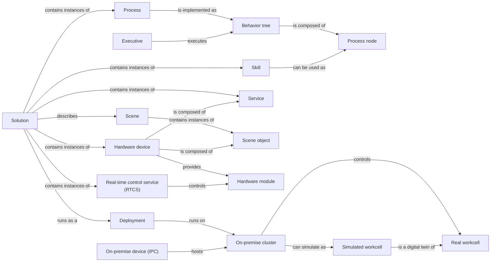

# Intrinsic terms

This glossary contains Intrinsic-specific terminology.
It includes terms that have a wider meaning in external literature but have
specific and refined semantics for Intrinsic (e.g., [skill](#skill)).
It also includes product names and associated terms for parts of the Intrinsic
platform (e.g., [ICON action](#icon-action)).

For general robotics and software terminology, see
[General terms](general_terms.md).

The following diagram summarizes the relationships between most of the items in
this glossary:

### Asset

A self-contained digital entity that can be installed in and reused across
[solution](#solution)s.
Types of assets include [scene object](#scene-object)s, [service](#service)s,
[hardware device](#hardware-device)s, [skill](#skill)s, [process](#process)es,
and [data](#data-asset).
Assets are associated with a [package](#package).

In Intrinsic Core, assets are built from source with Bazel and are distributed
as bundles (`<name>.bundle.tar`).

### Behavior tree

A way of implementing a [process](#process) as a tree data structure.
It is composed of [process node](#process-node)s that are parsed and executed by
the [executive](#executive).
Behavior trees are parameterizable and may be made reusable as their own
[process node](#process-node)s, nestable in other [process](#process)es.

### Bundle (bundle.tar)

A `.bundle.tar` archive produced by Bazel that packages an [asset](#asset)
(such as a [skill](#skill), [service](#service),
[scene object](#scene-object), or [hardware device](#hardware-device)) together
with its manifest and container images or data files, ready to be installed onto
a cluster with [`inctl` (`inctl asset install`)](#inctl-intrinsic-control-cli).

### Catalog

A hosted database that holds [asset](#asset)s intended for reuse between users
or organizations.

> [!NOTE]
> The catalog is a feature of [Intrinsic Enterprise](#intrinsic-enterprise).
> Intrinsic Core does not use the catalog: assets are built from source and
> installed directly onto a cluster.

### Compute

The computing resources on which a Kubernetes cluster is hosted, in which
platform services and installed software containers (e.g., [skill](#skill)s and
[service](#service)s) are run for a particular [solution](#solution).
For Intrinsic Core this is an [on-premise device](#on-premise-device); it can be
the same machine that you develop on.

### Configuration

A set of parameters provided by the user for an [asset](#asset) instance.
Some configuration parameters may be required, and others optional, in which
case there may or may not be a default value provided by the [asset](#asset)
author.
In Intrinsic Core, an instance's configuration is written as a text proto and
applied when the [solution](#solution) is deployed.

### Control flow

A type of [process node](#process-node) that controls the
[executive](#executive)'s progress through a [process](#process).
Examples of control flow include sequential, parallel, repeated, or conditional
execution.

### Data asset

A type of [asset](#asset) that stores a set of values, possibly including
references to other files.
Data assets can, for example, represent a perception ML model, or
[configuration](#configuration) values for another [asset](#asset).

### Data flow

The directed movement of information between skills.
Each skill can produce output data that serves as input for subsequent skills.

### Deployment

An instance of a [solution](#solution) running on an
[on-premise device](#on-premise-device).
Running one [solution](#solution) on multiple
[on-premise device](#on-premise-device)s results in multiple deployments.

### Digital twin

A virtual representation of [real workcell](#real-workcell) entities, including
[scene object](#scene-object)s, [hardware device](#hardware-device)s, or entire
[scene](#scene)s.
It serves as the associated entity's digital counterpart for practical purposes,
such as system simulation, integration, testing, monitoring, and maintenance.

### Executive

The platform [service](#service) responsible for executing a
[solution](#solution)'s user-specified [process](#process) (implemented as a
[behavior tree](#behavior-tree) consisting of [process node](#process-node)s).

### Flowstate

The web UI of [Intrinsic Enterprise](#intrinsic-enterprise).

### Geometry

The underlying mesh, points, and frames that make up a
[scene object](#scene-object).

### Hardware device

A type of [asset](#asset) composed of one [scene object](#scene-object) and one
or more [service](#service)s.
It represents the [digital twin](#digital-twin) of a
[real workcell](#real-workcell) entity that has both physical and behavioral
(i.e., software) aspects; i.e., performing perception and/or action.

### Hardware module

A software component that implements the interface between the
[real-time control service](#real-time-control-service-rtcs) and a specific
robot or device brand, protocol, or fieldbus.
A hardware module is delivered as part of a
[hardware device](#hardware-device) asset, and is parameterized with a
`HardwareModuleConfig` text proto.

### ICON action

The fundamental software building block for robot control in the
[real-time control framework](#intrinsic-real-time-control-framework-icon).
ICON actions encode real-time robot behaviors.
Skills can call, configure, and run custom ICON actions in the
[real-time control service](#real-time-control-service-rtcs) from a
non-real-time context, and have them executed in a real-time control loop.

### `inctl` (Intrinsic Control CLI)

The command line interface tool used to inspect and operate an
[Intrinsic Core](#intrinsic-core) or
[Intrinsic Enterprise](#intrinsic-enterprise) cluster, including installing
[asset](#asset) [bundles](#bundle-bundletar), managing [service](#service)
instances, resetting the [world](#world), and interacting with
[ICON](#intrinsic-real-time-control-framework-icon).

### Intrinsic Core

The open-source distribution of the Intrinsic platform, installed on a Linux
machine that you administer.
Intrinsic Core provides [asset](#asset)s, the [executive](#executive),
simulation, and real-time robot control via
[ICON](#intrinsic-real-time-control-framework-icon), and is operated from source
code and the `inctl` command line tool rather than from a web UI.

### Intrinsic Enterprise

The hosted, cloud-connected edition of the Intrinsic platform, operated through
the [Flowstate](#flowstate) web UI and the [catalog](#catalog).

> [!NOTE]
> Intrinsic Enterprise is a separate product from Intrinsic Core. Intrinsic
> Core shares the same [asset](#asset), [solution](#solution), and real-time
> control concepts, but has no web UI: solutions are defined in code and
> deployed and operated with the `inctl` command line tool. Documentation that
> refers to Flowstate panels, dialogs, or catalogs does not apply to Intrinsic
> Core.

### Intrinsic Real-Time Control Framework (ICON)

A part of the Intrinsic platform that executes real-time robot motion and
sensor-based control, and supports the integration of new real-time hardware.
It includes the [real-time control service](#real-time-control-service-rtcs), a
set of [hardware module](#hardware-module)s, and APIs for developing new
hardware modules.

### Intrinsic SDK

The collection of APIs, command line tools, and build system that allow a
software developer to create, test, and manage certain types of
[asset](#asset)s (e.g., [skill](#skill)s and [service](#service)s) and author
[process](#process)es via the
[Solution Building Library](#solution-building-library-sbl).

### IntrinsicOS

The Intrinsic-managed operating system that orchestrates all aspects of a
running [solution](#solution) on an [on-premise cluster](#on-premise-cluster).
It uses Kubernetes to distribute, manage, and operate containerized software.

> [!NOTE]
> IntrinsicOS is used by [Intrinsic Enterprise](#intrinsic-enterprise).
> Intrinsic Core instead runs on a standard Linux distribution that you install
> and manage yourself, with a Kubernetes distribution set up by the Intrinsic
> Core installation scripts.

### Node

See [process node](#process-node).

### On-premise cluster

A Kubernetes cluster running on an [on-premise device](#on-premise-device).
It can be used for editing or simulating a [solution](#solution), and has the
capacity to run a [deployment](#deployment) that interacts with the associated
[real workcell](#real-workcell).

### On-premise device

A physical hardware [compute](#compute) device that hosts an
[on-premise cluster](#on-premise-cluster) and is connected to a
[real workcell](#real-workcell).
It is also referred to as an Industrial PC (IPC).

For Intrinsic Core, this is a Linux machine that you provide and administer, and
that must meet the real-time requirements of the robots it controls. On
[Intrinsic Enterprise](#intrinsic-enterprise), it is an approved IPC running
[IntrinsicOS](#intrinsicos).

### Open Machine Tending Solution (OMTS)

An open-source reference [solution](#solution) built on
[Intrinsic Core](#intrinsic-core)
([`intrinsic-omts`](https://github.com/intrinsic-ai/intrinsic-omts)) that
demonstrates an end-to-end CNC machine tending application using pre-configured
[asset](#asset)s, [skill](#skill)s, 6-DoF pose estimation, motion planning, and
real-time force-controlled manipulation.

### Package

A string used as a prefix in the identifier for an [asset](#asset), for example
`ai.intrinsic` in `ai.intrinsic.ur5e_hardware_module_core`.
It is recommended to use a reverse DNS name of your organization's URL.

### Process

An [asset](#asset) type that defines a robot automation task, implemented as a
[behavior tree](#behavior-tree) composed of [process node](#process-node)s.

### Process node

An entity in a [process](#process) that represents either
[control flow](#control-flow) (e.g., sequential, parallel, repeated, or
conditional execution) or units of perception, computation, or action (e.g.,
[skill](#skill)s built as software containers, Python scripts, or
[behavior tree](#behavior-tree)s).

### Real-Time Control Service (RTCS)

An Intrinsic-provided [service](#service) for performing real-time control of
robots and devices on real-time fieldbuses or protocols.
It loads and runs one or more [hardware module](#hardware-module)s.

### Real workcell

All physical entities that comprise an automation solution.
This includes robots, end-of-arm tooling, cameras,
[on-premise device](#on-premise-device)s, safety equipment, and the enclosure.

### Scene

A geometric representation of a [real](#real-workcell) or
[simulated workcell](#simulated-workcell), consisting of instances of
[scene object](#scene-object)s in a particular kinematic configuration.
A scene may describe the initial state of a workcell or an in-progress snapshot
of the workcell in the midst of a running [process](#process).

### Scene object

Geometric models representing real, physical entities.
They can store visual and collision geometries as polygonal meshes; helper
frames or tool paths; kinematic joints and linkages; and metadata or
[configuration](#configuration) data (e.g., material properties, symmetry
information, the intrinsic parameters of a camera, or the kinematic properties
of a robot such as joint position, velocity, and acceleration limits).

### Service

An [asset](#asset) type that encapsulates arbitrary software in a container that
runs alongside the [executive](#executive) (which runs a [process](#process)) in
a running [solution](#solution).
It exposes [gRPC services](https://grpc.io) and is thus accessible to
[skill](#skill)s and other services.
Services may perform computation or interact with other systems over the network
or on fieldbuses.

### Simulated workcell

A [scene](#scene) that is loaded into a simulator that reflects, to some degree
of physical and visual fidelity, the effects of a running [solution](#solution)
and can provide input back to that [solution](#solution).
To the extent that the [scene](#scene) is an accurate
[digital twin](#digital-twin) of a [real workcell](#real-workcell), the
simulation indicates what should happen when the [solution](#solution) is run on
that [real workcell](#real-workcell).

### Skill

An [asset](#asset) type that encapsulates a particular automation behavior with
the ability (but not requirement) to be associated with other [asset](#asset)s,
such as [service](#service)s.
It is leveraged as a building block of robot behavior while authoring a
[process](#process).

### Skill footprint

The predicted set of utilized resources (including required
[service](#service)s, the spatial volume occupied or traversed, and nominal time
required) by a [skill](#skill) during its execution.
For example, the footprint of a joint move on a robot consists of the robot
hardware, its associated end-effector, the swept volume of the joint move, and
the time it takes to move.

### Skill prediction

Given a set of parameters and a [scene](#scene), the predicted output of a
[skill](#skill) and its expected effect on the real world.

### Solution

The data structure containing the combination and [configuration](#configuration)
of [asset](#asset)s and [scene](#scene)s to realize an automation task.
Software-based [asset](#asset)s like [behavior tree](#behavior-tree)s,
[skill](#skill)s, and [service](#service)s contain code that will run in the
course of a [process](#process), while other [asset](#asset)s like
[hardware device](#hardware-device)s and [scene object](#scene-object)s describe
the [real workcell](#real-workcell) in which that code will run.

In Intrinsic Core, a solution is defined by an `intrinsic_solution` Bazel target
that lists the assets and the configured asset instances it contains, and it is
deployed by running that target against a cluster.

### Solution Building Library (SBL)

A Python library in the [Intrinsic SDK](#intrinsic-sdk) that allows the
programmatic creation of [solution](#solution)s and [process](#process)es.

### World

The runtime model of the geometric relationships between all objects that a
[solution](#solution) knows about. See
[World concepts](../platform_introduction/world_concepts.md).
