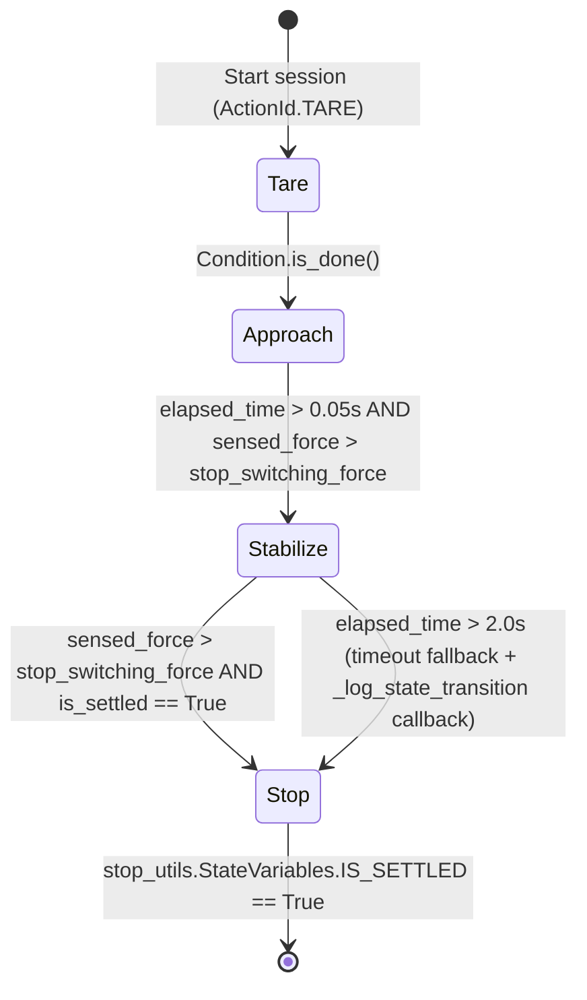

# ICON Client API: Authoring a Force-Controlled Skill

## 1. Overview, Prerequisites & Relation to OMTS

Before starting this tutorial, make sure you have completed:
- **[Tutorial 0: ICON Introduction](../icon_introduction/icon_introduction.md)**: Introduces the cyclic real-time control loop, Hardware Modules, Parts, Actions, Reactions, and Sessions.
- **[Tutorial 1: Robot Bringup](../robot_bringup.md)** *(specifically the **Adapting This Workflow for Universal Robots (UR)** section)*: Sets up a standalone Bazel workspace with `@ioc` pointing to `intrinsic-core`, configures the UR hardware module (`ur_config.textproto`), defines the `arm` part in `ur_icon_main_config.textproto`, and bundles `ur_solution` in `BUILD`.

This tutorial picks up directly from that Universal Robots workspace. You will enable the UR e-Series integrated 6-axis wrist force-torque sensor in ICON, learn how to program real-time action graphs and sensor-driven reactions using the **ICON Python Client API** ([`icon_api.py`](/incode/intrinsic_control/intrinsic/icon/python/icon_api.py)), and walk step-by-step through the production `move_to_contact` skill ([`move_to_contact.py`](/intrinsic/manipulation/skills/force/move_to_contact.py)).

> [!NOTE]
> **Relation to the Open Machine Tending Solution (`intrinsic-omts`)**
>
> In the reference **Open Machine Tending Solution ([`intrinsic-omts`](https://github.com/intrinsic-ai/intrinsic-omts))**, a Universal Robots arm uses its integrated wrist force-torque sensor and the `move_to_contact` skill across four contact stages:
> 1. **Infeed stock height probing (`15 N`)**: Searching downward to detect the top surface of raw workpieces stacked on the infeed table ([`src/behaviors/pick.py`](https://github.com/intrinsic-ai/intrinsic-omts/blob/main/src/behaviors/pick.py)).
> 2. **CNC vise seating (`8 N`)**: Pressing the raw part firmly against the CNC vise datum parallels before the pneumatic jaws close ([`src/behaviors/load_machine.py`](https://github.com/intrinsic-ai/intrinsic-omts/blob/main/src/behaviors/load_machine.py)).
> 3. **Finished part contact (`15 N`)**: Establishing compliant contact with the machined part inside the CNC vise prior to unloading ([`src/behaviors/unload_machine.py`](https://github.com/intrinsic-ai/intrinsic-omts/blob/main/src/behaviors/unload_machine.py)).
> 4. **Outfeed placement (`5 N`)**: Gently setting the finished workpiece down onto the outfeed table ([`src/behaviors/return_infeed.py`](https://github.com/intrinsic-ai/intrinsic-omts/blob/main/src/behaviors/return_infeed.py)).
>
> This tutorial explains the underlying hardware configuration and ICON Client API architecture that power those compliant motions in `intrinsic-omts`, showing you how to configure and build that capability from the ground up in your own minimal workspace.

---

## Step 1: Configure the UR Internal Force-Torque Sensor in ICON

Universal Robots e-Series arms (`ur3e`, `ur5e`, `ur10e`) feature a built-in 6-axis force-torque sensor at the tool flange (`InternalForceTorqueSensor` attached to `wrist_3_link` in [`ur5e_base.xacro`](/incode/intrinsic_control/intrinsic/models/robot_definitions/ur/ur5e/ur5e_base.xacro)). The UR hardware module exposes this sensor's measurements and tare commands through the `force_torque_status` and `force_torque_command` hardware interfaces (compare with [`configs/icon_config.textproto`](https://github.com/intrinsic-ai/intrinsic-omts/blob/main/configs/icon_config.textproto) in `intrinsic-omts`).

To expose the sensor to ICON skills and actions, open the `ur_icon_main_config.textproto` file you created in [Tutorial 1: Robot Bringup](../robot_bringup.md) (where the UR hardware module is named `"robot"`) and add a second entry (`key: "ft_sensor"` of type `HalForceTorqueSensorPart`) to `hardware_config.parts_by_name`:

```protobuf
# Append to hardware_config.parts_by_name in ur_icon_main_config.textproto:
  parts_by_name {
    key: "ft_sensor"
    value {
      part_type_name: "HalForceTorqueSensorPart"
      config {
        [type.googleapis.com/intrinsic_proto.icon.HalForceTorqueSensorPartConfig] {
          force_torque_state {
            module_name: "robot"
            interface_name: "force_torque_status"
          }
          force_torque_command {
            module_name: "robot"
            interface_name: "force_torque_command"
          }
          world_robot_collection_name: "robot"
          joint_position_state {
            module_name: "robot"
            interface_name: "joint_position_state"
          }
          target_link_name: "wrist_3_link"
          ft_sensor_link_name: "InternalForceTorqueSensor"
          force_control_settings {
            excessive_force_threshold: 85.0
            excessive_torque_threshold: 8.5
            virtual_translational_inertia: 15.0
            virtual_rotational_inertia: 1.0
            sensed_wrench_deadband {
              x: 1.5
              y: 1.5
              z: 1.5
              rx: 0.2
              ry: 0.2
              rz: 0.2
            }
          }
        }
      }
    }
  }
```

### Understanding `HalForceTorqueSensorPartConfig` and `ForceControlSettings`

The configuration schema is defined in [`hal_force_torque_sensor_part_config.proto`](/incode/intrinsic_apis/intrinsic/icon/control/parts/hal/force_torque_sensor_part/hal_force_torque_sensor_part_config.proto) and [`force_control_settings.proto`](/incode/intrinsic_apis/intrinsic/icon/equipment/force_control_settings.proto):

- **`force_torque_state` & `force_torque_command`**: Bind the ICON part to the 6-axis wrench stream (`force_torque_status`) and hardware zero/tare interface (`force_torque_command`) exported by the `"robot"` hardware module.
- **`target_link_name` & `ft_sensor_link_name`**: Identify the kinematic frames in the robot's SDF model ([`ur5e_base.xacro`](/incode/intrinsic_control/intrinsic/models/robot_definitions/ur/ur5e/ur5e_base.xacro)) used to transform sensed wrenches to the arm tip (`wrist_3_link`).
- **`force_control_settings` ([`force_control_settings.proto`](/incode/intrinsic_apis/intrinsic/icon/equipment/force_control_settings.proto))**: Defines maximum target wrench thresholds and admittance dynamics shared across force-control skills using this sensor:
  - **`excessive_force_threshold` (`85.0 N`) & `excessive_torque_threshold` (`8.5 N·m`)**: Maximum allowed target force and torque for force-control skills like `move_to_contact`.
  - **`virtual_translational_inertia` (`15.0 kg`) & `virtual_rotational_inertia` (`1.0 kg·m²`)**: Virtual Cartesian mass and rotational inertia rendered by the Cartesian admittance controller. Higher inertia slows down acceleration in response to external forces and increases stability against stiff environments. The configured virtual inertia must always be higher than the actual physical payload inertia.
  - **`sensed_wrench_deadband` (`1.5 N`, `0.2 N·m`)**: Per-axis deadband applied to raw wrench measurements to mask sensor noise and drift.

When ICON initializes with both `arm` (`HalArmPart`) and `ft_sensor` (`HalForceTorqueSensorPart`), the robot's `ResourceHandle` in the Solution is automatically populated with both `Icon2PositionPart` and `Icon2ForceTorqueSensorPart` (defined in [`icon_equipment.proto`](/incode/intrinsic_apis/intrinsic/icon/equipment/icon_equipment.proto)).

---

## Step 2: Add `move_to_contact` to your Solution

### 2.1 Declarative Bazel Integration

In the Bazel workspace from [Tutorial 1: Robot Bringup](../robot_bringup.md) (where `MODULE.bazel` registers `@ioc` pointing to `intrinsic-core`), add `@ioc//intrinsic/manipulation/skills/force:move_to_contact_skill` to the `assets` list of your `solution` target in `BUILD` (mirroring [`BUILD`](https://github.com/intrinsic-ai/intrinsic-omts/blob/main/BUILD) in `intrinsic-omts`):

```python
# In your workspace's BUILD file:
solution(
    name = "ur_solution",
    assets = [
        ":ur_hardware_module",
        "@ioc//intrinsic/manipulation/skills/force:move_to_contact_skill",
        "@ioc//intrinsic/World/Services:collision_checker",
        "@ioc//intrinsic/icon/services:icon_2",
        "@ioc//intrinsic/kinematics/services:kinematics_service",
    ],
    scene = ":ur_scene",
)
```

### 2.2 Building and Sideloading from `intrinsic-core`

If you are developing or customizing the skill directly inside a local checkout of `intrinsic-core` (or from your external Bazel workspace), you can build the skill's `.bundle.tar` archive with Bazel and sideload it into an already running solution via `inctl`:

```bash
# Build the move_to_contact skill bundle inside intrinsic-core:
bazel build //intrinsic/manipulation/skills/force:move_to_contact_skill

# Or build it from your external Bazel workspace:
bazel build @ioc//intrinsic/manipulation/skills/force:move_to_contact_skill

# Install the compiled skill bundle into your running solution:
# On Intrinsic Core (Local k3s cluster):
inctl asset install bazel-bin/intrinsic/manipulation/skills/force/move_to_contact_skill.bundle.tar --address localhost:17080

# On Intrinsic Enterprise (IPC):
inctl asset install bazel-bin/intrinsic/manipulation/skills/force/move_to_contact_skill.bundle.tar --cluster <cluster-name> --org <org@project>
```

---

## Step 3: Working with the ICON Python Client API

The ICON Python Client API ([`incode/intrinsic_control/intrinsic/icon/python/icon_api.py`](/incode/intrinsic_control/intrinsic/icon/python/icon_api.py)) allows skills and standalone scripts to compose real-time `Action`s and `Reaction`s and upload them to the ICON server.

While Python executes on the client side (non-real-time), the `Action`s and `Reaction`s you upload to the ICON server are evaluated deterministically by the ICON Control Layer on **every real-time control cycle** (for example, at `500 Hz` on Universal Robots e-Series or `250 Hz` on KUKA RSI).

> [!IMPORTANT]
> **Collision Avoidance in the Low-Level Client API**
>
> Low-level ICON Client API actions operate directly on joint and Cartesian controllers underneath the high-level motion planner. They enforce axis kinematic limits, but they **do not perform collision checking** against obstacles in the workcell scene. Always use a collision-checked motion planner to move the robot to a safe pre-contact approach pose before executing low-level ICON actions.

### 3.1 Connecting to ICON & Opening a Session

An `icon_api.Client` wraps the gRPC connection with the ICON server. You can instantiate a client in two ways:

1. **Inside an Intrinsic Skill (via `equipment_utils`)**: Use [`equipment_utils.py`](/incode/intrinsic_control/intrinsic/icon/equipment/equipment_utils.py) to extract the ICON connection details and configured part names directly from the robot's `ResourceHandle`:
   ```python
   from intrinsic.icon.equipment import equipment_utils
   from intrinsic.icon.python import icon_api

   resource_handle = context.resource_handles["robot"]
   icon_client: icon_api.Client = equipment_utils.init_icon_client(resource_handle)
   position_part_name: str = equipment_utils.get_position_part_name(resource_handle)
   ft_part_name: str = equipment_utils.get_force_torque_sensor_part_name(resource_handle)
   ```
2. **From a Standalone Script**: Connect directly via `icon_api.Client.connect(grpc_host="localhost", grpc_port=8128)` or `icon_api.Client.for_solution(solution, instance_name="robot")`, and query available parts with `icon_client.list_parts()`.

To command hardware parts, open a **`Session`** ([`_session.py`](/incode/intrinsic_control/intrinsic/icon/python/_session.py)) using a `with` statement and pass the list of part names you need to control:

```python
with icon_client.start_session(
    [position_part_name, ft_part_name],
    context=context.logging_context.data_logger_context,
) as session:
  # Stage actions, define reactions, and run the real-time state machine
  ...
```

Opening a session with `start_session` provides three key guarantees:
- **Exclusive Part Allocation**: Claims exclusive control of `position_part_name` (`"arm"`) and `ft_part_name` (`"ft_sensor"`). If another session already holds any requested part, `start_session` raises an error.
- **Reaction Event & Callback Handling**: Receives reaction notifications from the ICON server so your skill can wait on `EventFlag`s or invoke client-side Python callbacks whenever real-time reactions fire.
- **Automatic Cleanup**: Exiting the `with` block (whether normally or due to an exception) automatically ends the session, causing the ICON server to immediately stop any active actions and release the parts.

### 3.2 Constructing Actions & Force Control Primitives

An [`icon_api.Action`](/incode/intrinsic_control/intrinsic/icon/python/actions.py) instantiates a real-time control law on one or more hardware parts. Each `Action` consists of:
- **`action_id` (`int`)**: A unique integer identifier within the session (e.g., `1`, `2`, or an `IntEnum`).
- **`action_type` (`str`)**: The server action signature name (such as `"intrinsic.tare_force_torque_sensor"`, `"intrinsic.force_primitive"`, or `"intrinsic.stop"`).
- **`part_name_or_slot_part_map` (`str | Mapping[str, str]`)**: Either a single part name (for single-part actions like `"intrinsic.stop"`) or a dictionary mapping the action signature's slot names to part names (for multi-part actions like `"intrinsic.force_primitive"`, which maps `{"arm": position_part_name, "ft_sensor": ft_sensor_part_name}`).
- **`params` (`google.protobuf.Message`)**: Action-specific fixed parameters proto.
- **`reactions` (`Iterable[icon_api.Reaction]`)**: Optional list of reactions attached directly to this action.

While you can instantiate `icon_api.Action(...)` directly, ICON provides typed builder modules under `incode/intrinsic_control/intrinsic/icon/actions/`:

| Action Type Name | Python Builder Utility | Parts Controlled | Role in Motion & Force Control |
| :--- | :--- | :--- | :--- |
| `"intrinsic.tare_force_torque_sensor"` | [`tare_force_torque_sensor_utils.create_tare_force_torque_sensor_action`](/incode/intrinsic_control/intrinsic/icon/actions/tare_force_torque_sensor_utils.py) | `ft_sensor` | Zeroes out static sensor bias and gravity offset from the mounted tool/payload before contact motion begins. |
| `"intrinsic.force_primitive"` | [`force_primitive_utils.create_make_contact_action`](/incode/intrinsic_control/intrinsic/icon/actions/force_primitive_utils.py) | `{"arm": ..., "ft_sensor": ...}` | Runs a 6-DOF Cartesian admittance/impedance control law configured by a `MakeContact` primitive ([`force_primitives.proto`](/incode/intrinsic_control/intrinsic/icon/control/primitives/force_control/proto/force_primitives.proto)). |
| `"intrinsic.stop"` | [`stop_utils.create_stop_action`](/incode/intrinsic_control/intrinsic/icon/actions/stop_utils.py) | `arm` | Decelerates all arm joints to zero velocity and holds position. |
| `"intrinsic.trajectory_tracking"` | [`trajectory_tracking_action_utils.create_trajectory_tracking_action`](/incode/intrinsic_control/intrinsic/icon/actions/trajectory_tracking_action_utils.py) | `arm` | Tracks and interpolates a discretized joint-space trajectory (`JointTrajectoryPVA`), such as retracting along a planned path (`ActionId.MOVE_BACK` in `move_to_contact.py`). |
| `"intrinsic.point_to_point_move"` | [`point_to_point_move_utils.create_point_to_point_move_action`](/incode/intrinsic_control/intrinsic/icon/actions/point_to_point_move_utils.py) | `arm` | Generates and executes a jerk-limited joint-space trajectory directly to a target joint configuration. |

Each helper constructs and returns an `icon_api.Action`:

```python
from intrinsic.icon.actions import force_primitive_utils
from intrinsic.icon.actions import point_to_point_move_utils
from intrinsic.icon.actions import stop_utils
from intrinsic.icon.actions import tare_force_torque_sensor_utils

# Single-part action (target part passed as a string):
tare_action = tare_force_torque_sensor_utils.create_tare_force_torque_sensor_action(
    action_id=1,
    force_torque_sensor_part_name=ft_part_name,
)
stop_action = stop_utils.create_stop_action(
    action_id=2,
    joint_position_part_name=position_part_name,
)
retract_action = point_to_point_move_utils.create_point_to_point_move_action(
    action_id=3,
    joint_position_part_name=position_part_name,
    goal_position=[0.0, -1.57, 1.57, -1.57, -1.57, 0.0],
)

# Multi-part action (target parts mapped by slot dictionary {"arm": ..., "ft_sensor": ...}):
approach_action = force_primitive_utils.create_make_contact_action(
    action_id=4,
    joint_position_part_name=position_part_name,
    ft_sensor_part_name=ft_part_name,
    primitive=approach_primitive,
    force_control_settings=force_control_params,
    task_params=task_params,
)
```

#### How the `MakeContact` Force Primitive Works

The `MakeContact` primitive ([`force_primitives.proto`](/incode/intrinsic_control/intrinsic/icon/control/primitives/force_control/proto/force_primitives.proto) and [`force_primitive.proto`](/incode/intrinsic_control/intrinsic/icon/actions/force_primitive.proto)) configures a Cartesian force-control law with three key properties:

1. **Zero Stiffness Along `motion_direction`**: Along the unit vector `motion_direction`, the Cartesian spring stiffness is set to `0 N/m`, and a constant feedforward reference wrench $F_{\text{ref}} = f_{\text{max}} \cdot \hat{d}$ (where $f_{\text{max}}$ is `max_contact_force` and $\hat{d}$ is the unit motion direction) is applied. In free space (where sensed external force is zero), the virtual damping matrix $D$ (computed to be overdamped for the configured `virtual_cartesian_inertia` and `environment_stiffness`) converts this feedforward force into a steady approach velocity $v_{\text{approach}} = D^{-1} F_{\text{ref}}$. When the tool touches a surface, the sensed opposing force balances $F_{\text{ref}}$ so the robot naturally decelerates and regulates the contact force at `max_contact_force`.
2. **Nullspace Stiffness Orthogonal to `motion_direction`**: Orthogonal to `motion_direction`, the controller maintains active virtual springs (`tool_translational_stiffness_in_nullspace` in `N/m` and `tool_rotational_stiffness_in_nullspace` in `N·m/rad`) so the tool stays on its approach line and maintains orientation while remaining compliant to slight surface misalignments.
3. **Reference Low-Pass Filter (`disable_reference_lowpass_filter`)**: When chaining multiple force-control actions, the first force-control action in the sequence requires `disable_reference_lowpass_filter=False` so the initial reference wrench is smoothly ramped in, whereas all subsequent force-control actions (such as `stabilize_action`) must set `disable_reference_lowpass_filter=True` so the reference wrench continues seamlessly across the action transition.

### 3.3 Building Real-Time Conditions

A [`Condition`](/incode/intrinsic_control/intrinsic/icon/python/reactions.py) is a Boolean expression tree evaluated by the ICON server on every control cycle while its associated action is active.

#### Comparison & Logical Combinators

- **Completion & Boolean checks**:
  - `icon_api.Condition.is_done()`: True when the active action's built-in `"intrinsic.is_done"` state variable becomes `True` (for example, when `TareForceTorqueSensor` finishes zeroing the sensor).
  - `icon_api.Condition.is_true(state_variable_name)` / `icon_api.Condition.is_false(state_variable_name)`
- **Threshold & equality comparisons**:
  - `icon_api.Condition.is_greater_than(state_variable_name, value)` / `is_greater_than_or_equal(...)`
  - `icon_api.Condition.is_less_than(state_variable_name, value)` / `is_less_than_or_equal(...)`
  - `icon_api.Condition.is_equal(state_variable_name, value)` / `is_approx_equal(state_variable_name, value, max_abs_error=0.001)`
- **Composite Boolean logic**:
  - `icon_api.Condition.all_of([cond_1, cond_2, ...])` (logical `AND`)
  - `icon_api.Condition.any_of([cond_1, cond_2, ...])` (logical `OR`)
  - `icon_api.Condition.is_not(cond)` (logical `NOT`)

#### Action-Local State Variables vs. Part Status State Variable Paths

The `state_variable_name` string passed to a `Condition` can reference two kinds of real-time signals:

1. **Action-Local State Variables**: Published by the currently executing action instance. Always prefer each action module's `StateVariables` constants over raw strings, as state variable names are scoped to the action signature:
   - For `intrinsic.force_primitive` and `intrinsic.cartesian_admittance_action`, [`cartesian_admittance_utils.StateVariables`](/incode/intrinsic_control/intrinsic/icon/actions/cartesian_admittance_utils.py) (aliased as `force_primitive_utils.StateVariables`) provides:
     - `StateVariables.ELAPSED_TIME_SECONDS` (`"elapsed_time_seconds"`): Time in seconds since the action became active.
     - `StateVariables.SENSED_FORCE` (`"intrinsic.sensed_force"`): Euclidean norm $\|F\|_2$ (in Newtons) of the sensed wrench at the tool frame.
     - `StateVariables.IS_SETTLED` (`"intrinsic.is_settled"`): `True` when the tool velocity has settled near zero.
     - `StateVariables.SETTLED_FOR_SECONDS` (`"intrinsic.settled_for_seconds"`): Duration in seconds for which the controller has remained settled.
     - `StateVariables.DISTANCE_TRAVELED` (`"intrinsic.translational_distance_traveled"`): Translational distance (in meters) traveled since the action started.
   - For `intrinsic.stop`, [`stop_utils.StateVariables`](/incode/intrinsic_control/intrinsic/icon/actions/stop_utils.py) provides:
     - `stop_utils.StateVariables.IS_SETTLED` (`"is_settled"`): `True` when all joint velocities have settled after decelerating to a stop.

2. **Part Status State Variable Paths (`icon_api.StateVariablePath`)**: Telemetry fields published by any hardware part on the ICON server, constructed via [`state_variable_path.py`](/incode/intrinsic_control/intrinsic/icon/python/state_variable_path.py) (which builds `@<part_name>.<PartType>.<field>` strings):
   ```python
   # Force-torque sensor part telemetry (@ft_sensor.ForceTorqueSensorPart...):
   ft_mag_path = icon_api.StateVariablePath.ForceTorque.force_magnitude_at_tip(ft_part_name)
   ft_z_path = icon_api.StateVariablePath.ForceTorque.wrench_at_tip(
       ft_part_name, icon_api.StateVariablePath.ForceTorque.WrenchDimension.Z
   )

   # Arm part telemetry (@arm.ArmPart...):
   tip_speed_path = icon_api.StateVariablePath.Arm.base_linear_velocity_tip_sensed(
       position_part_name
   )

   # Digital input telemetry (@adio.ADIOPart.di.block[0]):
   di_path = icon_api.StateVariablePath.ADIO.digital_input(
       adio_part_name, block_name="sensor_block", signal_index=0
   )
   ```

### 3.4 Defining Reactions, Real-Time Transitions, Callbacks & Events

A [`Reaction`](/incode/intrinsic_control/intrinsic/icon/python/reactions.py) binds a `Condition` to a list of responses that execute when the condition becomes `True`.

ICON supports two distinct categories of responses:

| Response Class | Where It Executes | Latency | Behavior |
| :--- | :--- | :--- | :--- |
| **`icon_api.StartActionInRealTime(next_action_id)`** | **ICON Real-Time Control Loop** (server-side) | **Same real-time cycle** | Immediately stops the associated action and starts `next_action_id` within the same real-time control cycle without waiting for Python or gRPC. |
| **`icon_api.StartParallelActionInRealTime(action_id)`** | **ICON Real-Time Control Loop** (server-side) | **Same real-time cycle** | Starts `action_id` within the same real-time control cycle on a disjoint part while keeping the current action running. |
| **`icon_api.TriggerCallback(callback)`** | **Python Client Process** (watcher thread) | Asynchronous (gRPC stream) | Invokes `callback(timestamp, previous_action_id, current_action_id)` on the client side for logging or diagnostics. |
| **`icon_api.Event(event_flag)`** | **Python Client Process** (watcher thread) | Asynchronous (gRPC stream) | Signals an `icon_api.EventFlag`, waking up any Python thread blocked on `event_flag.wait(timeout=...)`. |

#### Pattern A: Explicit `icon_api.Reaction` Construction

You can attach `icon_api.Reaction` objects directly to `Action.reactions` (or register them via `session.add_reactions(action, [...])`), upload the actions with `session.add_actions([...])`, start the entry action with `session.start_action(...)`, and wait on an `icon_api.EventFlag`:

```python
from intrinsic.icon.actions import force_primitive_utils
from intrinsic.icon.actions import stop_utils
from intrinsic.icon.python import icon_api

done_flag = icon_api.EventFlag()

def on_contact_detected(timestamp, prev_id, curr_id):
  print(f"[{timestamp}] Contact triggered transition: {prev_id} -> {curr_id}")

# 1. Attach a reaction to approach_action that switches to stop_action in real time
#    AND asynchronously invokes on_contact_detected in Python:
approach_action.reactions = [
    icon_api.Reaction(
        condition=icon_api.Condition.all_of([
            icon_api.Condition.is_greater_than(
                force_primitive_utils.StateVariables.ELAPSED_TIME_SECONDS, 0.05
            ),
            icon_api.Condition.is_greater_than(
                force_primitive_utils.StateVariables.SENSED_FORCE, 5.0
            ),
        ]),
        responses=[
            icon_api.StartActionInRealTime(stop_action.id),
            icon_api.TriggerCallback(on_contact_detected),
        ],
    )
]

# 2. Attach a reaction to stop_action that signals done_flag when the arm settles:
stop_action.reactions = [
    icon_api.Reaction(
        condition=icon_api.Condition.is_true(
            stop_utils.StateVariables.IS_SETTLED
        ),
        responses=[icon_api.Event(done_flag)],
    )
]

# 3. Upload both actions (and their attached reactions), start approach_action, and wait:
session.add_actions([approach_action, stop_action])
session.start_action(approach_action.id)
done_flag.wait(timeout=30.0)
```

#### Pattern B: Ergonomic Session Helpers

Because chaining actions via `StartActionInRealTime` and waiting on a final `EventFlag` is the most common state-machine pattern in ICON skills, `Session` provides two high-level methods that construct and register those exact `Reaction` objects for you:

1. **`session.add_action_sequence([elem_1, elem_2, ..., elem_N]) -> icon_api.EventFlag`**:
   - Accepts a sequence where each element is either an `Action` (which defaults to transitioning on `Condition.is_done()`) or a tuple `(Action, Condition)` specifying a custom transition condition.
   - Automatically connects each element `i` to element `i+1` with `Reaction(condition_i, responses=[StartActionInRealTime(action_{i+1}.id)])`.
   - Attaches an `Event(done_flag)` reaction to the final element `N` and returns `done_flag`.
2. **`session.add_transition(from_action, to_action, condition, callback=None) -> icon_api.EventFlag`**:
   - Adds a branching or fallback transition between two already-added actions (such as a timeout transition from `stabilize_action` to `stop_action`).
   - Registers a `Reaction` on `from_action` with `StartActionInRealTime(to_action.id)`, `Event(signal)`, and (if provided) `TriggerCallback(callback)`.

---

## Step 4: Walkthrough of the Production `move_to_contact` Skill

Now let's examine how the production `move_to_contact` skill in `intrinsic-core` combines these building blocks into a fault-tolerant 4-state real-time state machine.

Repository files:
- **Skill Manifest**: [`intrinsic/manipulation/skills/force/move_to_contact_manifest.textproto`](/intrinsic/manipulation/skills/force/move_to_contact_manifest.textproto)
- **Skill Parameter Schema**: [`intrinsic/manipulation/skills/force/move_to_contact.proto`](/intrinsic/manipulation/skills/force/move_to_contact.proto) and [`intrinsic/manipulation/skills/force/contact_stiffness.proto`](/intrinsic/manipulation/skills/force/contact_stiffness.proto)
- **Python Implementation**: [`intrinsic/manipulation/skills/force/move_to_contact.py`](/intrinsic/manipulation/skills/force/move_to_contact.py)

### 4.1 Resolving Parts & Deadband Thresholds

In [`move_to_contact_manifest.textproto`](/intrinsic/manipulation/skills/force/move_to_contact_manifest.textproto), the skill declares a `"robot"` resource slot requiring `IconApi`, `Icon2PositionPart`, and `Icon2ForceTorqueSensorPart`. During `execute()`, `move_to_contact.py` unpacks the `ForceControlSettings` you configured in Step 1 and initializes the ICON client:

```python
    resource_handle = context.resource_handles[_EQUIPMENT_SLOT]
    force_control_params = utils.ForceControlParams.from_resource_handle(
        resource_handle
    )

    self.validate_parameters(
        params, max_force=force_control_params.excessive_force_threshold
    )

    world = context.object_world
    icon_client: icon_api.Client = equipment_utils.init_icon_client(
        resource_handle
    )
    position_part_name: str = equipment_utils.get_position_part_name(
        resource_handle
    )
    ft_part_name: str = equipment_utils.get_force_torque_sensor_part_name(
        resource_handle
    )
```

Next, the skill projects `sensed_wrench_deadband` onto `motion_direction_in_base` and calculates the switching force threshold `stop_switching_force`:

```python
    projected_wrench_deadband_norm = (
        utils.compute_projected_wrench_deadband_norm(
            force_control_params.sensed_wrench_deadband,
            motion_direction_in_base,
        )
    )
    min_contact_force = 2.0 * projected_wrench_deadband_norm

    if params.contact_force < min_contact_force:
      raise SkillError(
          PARAMETER_ERROR_CODE,
          "Parameter contact_force must be greater than 2 * norm of "
          f"force_control_settings.sensed_wrench_deadband({min_contact_force}) "
          "defined in the force-torque-sensor part config.",
      )

    stop_switching_force = max(
        params.contact_force * STOP_FORCE_RATIO,
        min_contact_force,
    )
```

With the `1.5 N` per-axis deadband from Step 1, a motion along a single principal axis (such as `+Z`) has `projected_wrench_deadband_norm = 1.5 N` and `min_contact_force = 3.0 N`. Setting `STOP_FORCE_RATIO = 0.5` means `stop_switching_force` is `max(0.5 * contact_force, 3.0 N)`—triggering the transition from `Approach` to `Stabilize` as soon as sensed contact force reaches half the target force (or the minimum deadband margin).

### 4.2 Constructing the Action Primitives

Next, `execute()` in `move_to_contact.py` builds the four actions:

```python
    tare_action = create_action_utils.create_tare_force_torque_sensor_action(
        action_id=ActionId.TARE, force_torque_sensor_part_name=ft_part_name
    )

    task_params = create_action_utils.build_task_params(
        robot_tip_t_robot_tool=tip_t_tool,
        robot_base_t_task=data_types.Pose3.identity(),
        contact_stiffness=_get_contact_stiffness(params),
    )

    approach_primitive = force_primitives_pb2.MakeContact(
        max_contact_force=params.contact_force,
        motion_direction=force_primitives_pb2.Direction(
            vector=proto_conversion.ndarray_to_vector3_proto(
                motion_direction_in_base
            ),
        ),
        controller_params=_get_controller_params(params),
    )

    approach_action = create_action_utils.create_make_contact_action(
        action_id=ActionId.APPROACH,
        joint_position_part_name=position_part_name,
        ft_sensor_part_name=ft_part_name,
        primitive=approach_primitive,
        force_control_settings=force_control_params,
        task_params=task_params,
    )

    stabilize_action = create_action_utils.create_make_contact_action(
        action_id=ActionId.STABILIZE,
        joint_position_part_name=position_part_name,
        ft_sensor_part_name=ft_part_name,
        primitive=approach_primitive,
        force_control_settings=force_control_params,
        task_params=task_params,
        disable_reference_lowpass_filter=True,
    )

    stop_action = create_action_utils.create_stop_action(
        action_id=ActionId.JOINT_STOP,
        joint_position_part_name=position_part_name,
    )
```

### 4.3 Staging the Reactive State Machine

Inside `with icon_client.start_session(...) as session:`, `move_to_contact.py` wires the four actions together using `session.add_action_sequence` for the nominal path and `session.add_transition` for the stabilization timeout fallback:



```python
      with icon_client.start_session(
          [position_part_name, ft_part_name],
          context=context.logging_context.data_logger_context,
      ) as session:
        session.add_action_sequence([
            tare_action,
            (
                approach_action,
                icon_api.Condition.all_of([
                    # The minimal approach time ensures that short force spikes
                    # when starting the motion do not trigger the reaction. This
                    # happens sometimes in simulation and makes the skill flaky.
                    icon_api.Condition.is_greater_than(
                        force_primitive_utils.StateVariables.ELAPSED_TIME_SECONDS,
                        MIN_APPROACH_TIME_S,
                    ),
                    icon_api.Condition.is_greater_than(
                        force_primitive_utils.StateVariables.SENSED_FORCE,
                        stop_switching_force,
                    ),
                ]),
            ),
            (
                stabilize_action,
                icon_api.Condition.all_of([
                    icon_api.Condition.is_greater_than(
                        force_primitive_utils.StateVariables.SENSED_FORCE,
                        stop_switching_force,
                    ),
                    icon_api.Condition.is_true(
                        force_primitive_utils.StateVariables.IS_SETTLED
                    ),
                ]),
            ),
            stop_action,
        ])

        def _log_state_transition(
            timestamp: datetime.datetime, from_action_id: int, to_action_id: int
        ):
          del timestamp, from_action_id, to_action_id
          nonlocal timeout
          logging.warning(
              "Settling in contact timed out, stopping move_to_contact motion."
          )
          timeout = True

        session.add_transition(
            stabilize_action,
            stop_action,
            icon_api.Condition.is_greater_than(
                force_primitive_utils.StateVariables.ELAPSED_TIME_SECONDS,
                SETTLING_TIMEOUT_S,
            ),
            _log_state_transition,
        )
```

Notice how the state machine handles real-world physical artifacts:
1. **Inertial Spike Guard (`MIN_APPROACH_TIME_S = 0.05` s)**: When `approach_action` first accelerates the robot arm, the mass of the end-effector can create a brief inertial wrench spike on the wrist sensor. Requiring `ELAPSED_TIME_SECONDS > 0.05` inside `Condition.all_of([...])` prevents initial acceleration inertia from falsely triggering contact.
2. **Two-Stage Contact Settling (`Approach` -> `Stabilize` -> `Stop`)**: Once `SENSED_FORCE > stop_switching_force`, the server transitions in real time to `stabilize_action`. Waiting in `stabilize_action` until both `SENSED_FORCE > stop_switching_force` **and** `IS_SETTLED` are simultaneously true ensures that the robot's kinetic energy is dissipated while still actively regulating contact force—guaranteeing that the robot stops in contact and does not move out of contact when `stop_action` engages (with a `SETTLING_TIMEOUT_S = 2.0` s fallback transition via `session.add_transition(...)` if surface vibration prevents `IS_SETTLED` from becoming true).

### 4.4 Execution & Cooperative Cancellation

Finally, `execute()` in `move_to_contact.py` starts the sequence using `IconSkillCanceller`:

```python
        icon_canceller = cancelation.IconSkillCanceller(
            session,
            context.canceller,
            tare_action,
            stop_action,
            success_condition=icon_api.Condition.is_true(
                stop_utils.StateVariables.IS_SETTLED
            ),
        )
        icon_canceller.start_and_wait(
            timeout_s=params.timeout_sec,
        )

        if icon_canceller.was_canceled():
          raise skill_interface.SkillCancelledError()
```

`IconSkillCanceller` starts `tare_action` and waits for `stop_action` to satisfy `IS_SETTLED`. If the user or executive cancels the skill mid-motion, `IconSkillCanceller` immediately commands `session.start_action(stop_action.id)` and waits for the arm to come to a complete stop before raising `SkillCancelledError`.

---

## Step 5: Running `move_to_contact` with the Solution Building Library

Once `ur_solution` is running with the `ft_sensor` part (Step 1) and the `move_to_contact_skill` asset (Step 2), you can invoke `move_to_contact` from a Python script using the **Solution Building Library (SBL)**.

Because the Universal Robots model provides a built-in `flange` frame (`world.robot.flange`), you can test compliant touchdown onto a surface (such as the base-plate) without needing an external gripper:

```python
from intrinsic.solutions import deployments

# 1. Connect to the running ur_solution deployment
solution = deployments.connect_to_selected_solution()
resources = solution.resources
world = solution.world
skills = solution.skills
executive = solution.executive

# 2. Access the move_to_contact skill wrapper
move_to_contact = skills.ai.intrinsic.move_to_contact

# 3. Move the UR flange along its local +Z axis until 5.0 N of contact force is reached
touchdown_task = move_to_contact(
    robot=resources.robot,
    tool=world.robot.flange,
    contact_force=5.0,
    timeout_sec=20.0,
    fixed_vector=move_to_contact.intrinsic_proto.manipulation.skills.FixedVector(
        direction=move_to_contact.intrinsic_proto.Vector3(x=0.0, y=0.0, z=1.0)
    ),
)

# 4. Execute the compliant touchdown motion
executive.run(touchdown_task)
```

### Reference SBL Implementations in `intrinsic-omts`

To see how `move_to_contact` is wrapped and parameterized in a full production application, inspect these files in [`intrinsic-omts`](https://github.com/intrinsic-ai/intrinsic-omts):
- **Robot Helper Method (`UrRobot.build_move_to_contact_task`)**: [`src/hardware/robot.py`](https://github.com/intrinsic-ai/intrinsic-omts/blob/main/src/hardware/robot.py)
- **Compliant Touchdown Behavior (`create_compliant_touchdown_task`)**: [`src/behaviors/motions.py`](https://github.com/intrinsic-ai/intrinsic-omts/blob/main/src/behaviors/motions.py)
- **Infeed Stock Height Probing (`15 N`)**: [`src/behaviors/pick.py`](https://github.com/intrinsic-ai/intrinsic-omts/blob/main/src/behaviors/pick.py)
- **CNC Vise Seating (`8 N`)**: [`src/behaviors/load_machine.py`](https://github.com/intrinsic-ai/intrinsic-omts/blob/main/src/behaviors/load_machine.py)
- **Finished Part Unloading Contact (`15 N`)**: [`src/behaviors/unload_machine.py`](https://github.com/intrinsic-ai/intrinsic-omts/blob/main/src/behaviors/unload_machine.py)
- **Outfeed Table Placement (`5 N`)**: [`src/behaviors/return_infeed.py`](https://github.com/intrinsic-ai/intrinsic-omts/blob/main/src/behaviors/return_infeed.py)

---

## Next Steps

- [ROS 2 Control Bridge Tutorial](../ros2_bridge_tutorial.md)
- [Custom Hardware Modules Tutorial](../custom_hardware_modules_tutorial.md)
