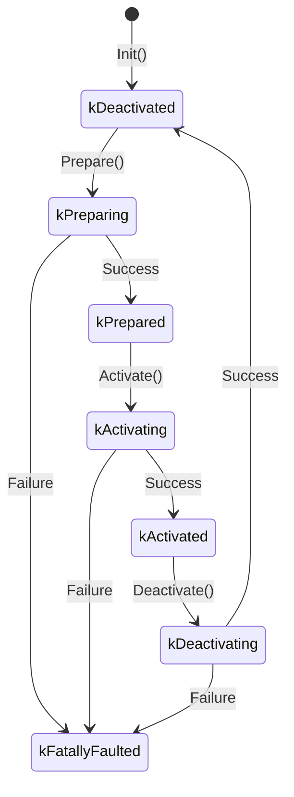
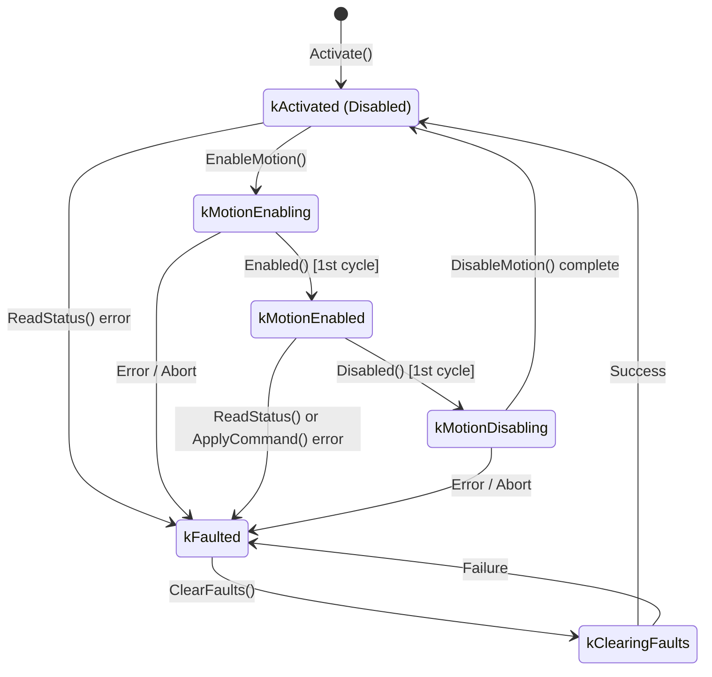
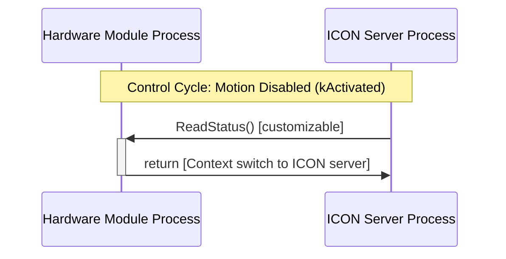
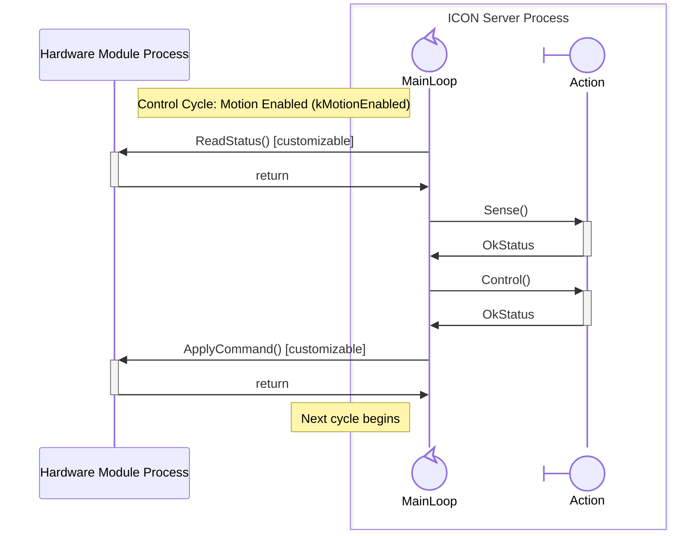

# ICON custom hardware module guide

<a name="introduction-hardware"></a>
## Introduction to the hardware abstraction layer

ICON's hardware abstraction layer ("HAL") is responsible for translating
commands from [ICON's real-time control layer ("RTCL")](/developer_resources/learn/tutorials/interactive_tutorials/icon/icon_introduction/icon_introduction.md) into hardware-specific
commands. It is also responsible for reporting hardware status to the RTCL.

You can add support for new real-time hardware to ICON by writing a *custom hardware module*.

A custom hardware module is an executable binary that runs in a dedicated
Kubernetes pod on the real-time PC ("RTPC"). The hardware module implementation
is a C++ class containing methods, some of which execute in a real-time context.

Communication between the ICON server and the custom hardware module is
established through *hardware interfaces*. These hardware interfaces are
flatbuffer objects stored in shared memory. The custom hardware module
implementation reads and writes to these objects directly using flatbuffer APIs.
Therefore, we recommend that anyone writing custom hardware modules be familiar
with flatbuffers.


<a name="prerequisites"></a>
## Prerequisites

Before you can start the development of your *custom hardware module* this guide expects the following:

- You are familiar with the [ICON real-time control service](/developer_resources/learn/tutorials/interactive_tutorials/icon/icon_introduction/icon_introduction.md)

- The hardware you want to control is physically connected to an IPC that has been configured [with k3s](/intrinsic_runtime/setup_k3s.sh) and [real-time execution](/intrinsic_runtime/setup_realtime.sh)
- Your development machine has a direct Ethernet connection to the IPC (same network as the IPC's uplink port)

The next step is to set up the [development environment](#development-environment) on your development machine.

<a name="development-environment"></a>
## Development environment

This section explains how to set up the local development environment.

<a name="install-requirements"></a>
### Installation requirements

The guide and repo use the [*bazel*](https://bazel.build/about/intro) build tool.
We recommend following this [installation guide](https://github.com/bazelbuild/bazelisk#installation).


<a name="build-and-deploy"></a>
## Build and deploy a hardware module

The easiest way to begin working with hardware modules is to compile and deploy
an existing one. This guide references the *loopback hardware module* which
only reports back the commanded joint position every cycle, as well as the slightly more complex *fake hardware module*.
When adding support for custom hardware, we recommend using this loopback hardware module as
a starting point.

### Build

You can compile the loopback hardware module targets with Bazel:

```sh
# Build the C++ library
bazel build //intrinsic_control/intrinsic/icon/hardware_modules/loopback:loopback_hardware_module

# Build the hardware module binary
bazel build //intrinsic_control/intrinsic/icon/hardware_modules/loopback:loopback_hardware_module_main

# Build the container image for deployment (note: building the image transitively builds the binary and library)
bazel build //intrinsic_control/intrinsic/icon/hardware_modules/loopback:loopback_hardware_module_image
```

### Deploy

To deploy a hardware module to a target cluster, we recommend bundling it as an *Intrinsic Hardware Device* asset (`intrinsic_hardware_device`). While a hardware module can also be deployed directly as a standalone `intrinsic_service` (e.g. during development), bundling it into a hardware device is preferred because it bundles the physical model and simplifies simulation and real-time control service configuration.

Here we use the KUKA KR6 R900-2 loopback hardware module (`kr6_r900_2_loopback_hardware_module`) as an example (you can similarly use `kr6_r900_2_fake_hardware_module`).
These are `intrinsic_hardware_device`s that bundle a loopback, or fake, hardware module service with a scene object of a KUKA KR6 R900-2.

It's helpful to create a minimal application that contains a fully configured realtime control service and hardware module as explained in the 
[robot bringup tutorial](/developer_resources/learn/tutorials/interactive_tutorials/icon/robot_bringup.md).
But fully restarting that application every time you make a change to your hardware module will take a bit of time. You can iterate faster if you start the application once, and then build and deploy just your hardware device asset, as described below.

#### 1. Build the Asset Bundle
Using Bazel, build the `kr6_r900_2_loopback_hardware_module` target:

```bash
bazel build //intrinsic_control/intrinsic/icon/hardware_modules/kuka_rsi:kr6_r900_2_loopback_hardware_module
```

*Expected Output:*
```text
Target //intrinsic_control/intrinsic/icon/hardware_modules/kuka_rsi:kr6_r900_2_loopback_hardware_module up-to-date:
  bazel-bin/intrinsic_control/intrinsic/icon/hardware_modules/kuka_rsi/kr6_r900_2_loopback_hardware_module.bundle.tar
INFO: Build completed successfully, 1 total action
```

Once compilation completes, Bazel packages the geometry, metadata, and container images into a hermetic bundle archive located at:
`bazel-bin/intrinsic_control/intrinsic/icon/hardware_modules/kuka_rsi/kr6_r900_2_loopback_hardware_module.bundle.tar`

#### 2. Install the Asset on the Cluster

This section uses the `inctl` tool to interact with the cluster.

You can install it as described in the [robot bringup tutorial](/developer_resources/learn/tutorials/interactive_tutorials/icon/robot_bringup.md) using [env.sh](/developer_resources/learn/tutorials/interactive_tutorials/icon/files/env.sh).
Alternatively, you can replace the `inctl` calls below with `bazel run //intrinsic/tools/inctl:inctl_external --`.

> [!IMPORTANT]
> **Operation Mode: Real vs. Simulation**
> Hardware modules only run their code in **real mode**. In simulation mode, the Gazebo simulation server exposes the respective shared memory interfaces instead of the physical hardware module.
>
> If you execute `inctl service add` on a cluster where no solution is running, the command will fail with:
> ```text
> Error: failed to add "<name>": code:2 message:"operation mode unspecified"
> ```
> Hardware devices require an active Solution context (which specifies whether the workcell is in simulation or physical hardware mode). Ensure that you have created and started an active Solution on the cluster before adding the hardware device.

Upload and register the bundle into the cluster's asset catalog:

```bash
inctl asset install bazel-bin/intrinsic_control/intrinsic/icon/hardware_modules/kuka_rsi/kr6_r900_2_loopback_hardware_module.bundle.tar \
  --address localhost:17080
```

*Expected Output:*
```text
Awaiting completion of the installation
Finished installing "ai.intrinsic.loopback_hardware_module.0.0.1+..."
```

Verify that the asset is listed in the catalog:

```bash
inctl asset list --address localhost:17080 | grep loopback
```

*Expected Output:*
```text
ai.intrinsic.loopback_hardware_module
```

#### 3. Add the Hardware Device Service Instance
Instantiate the hardware device into your active Solution under the name `kuka_rsi_hal_module`:

```bash
inctl service add ai.intrinsic.loopback_hardware_module --name=kuka_rsi_hal_module \
  --address localhost:17080
```

*Expected Output:*
```text
Requesting "kuka_rsi_hal_module" be added as a service instance
Awaiting completion of the add operation
Finished adding service "kuka_rsi_hal_module"
```

Verify that the service instance is active:

```bash
inctl asset instances list --address localhost:17080
```

*Expected Output:*
```text
Name                Asset
kuka_rsi_hal_module ai.intrinsic.loopback_hardware_module
```

You should see `kuka_rsi_hal_module` running alongside other services.

### Explanation of the BUILD rules

Examples of build targets for creating a hardware module can be found in
[`loopback/BUILD`](/intrinsic_control/intrinsic/icon/hardware_modules/loopback/BUILD) and
[`fake/BUILD`](/intrinsic_control/intrinsic/icon/hardware_modules/fake/BUILD).

To create your own custom hardware module, you will need to recreate a 
similar set of targets. These have the following roles:

*   A `cc_library` to create a library containing your custom hardware module
    implementation. 
    This must implement the ([`hardware_module_interface.h`](/intrinsic_control/intrinsic/icon/hal/hardware_module_interface.h)) (e.g. [`:fake_module` in `fake/BUILD#L64`](/intrinsic_control/intrinsic/icon/hardware_modules/fake/BUILD#L64)).
    To export the module to the runtime registry ([`hardware_module_registry.h`](/intrinsic_control/intrinsic/icon/hal/hardware_module_registry.h)), registration can be included directly in this library with `alwayslink = 1` (as in [`loopback/BUILD#L29`](/intrinsic_control/intrinsic/icon/hardware_modules/loopback/BUILD#L29)), or defined in a separate registration library (e.g. [`:fake_module_register` in `fake/BUILD#L129`](/intrinsic_control/intrinsic/icon/hardware_modules/fake/BUILD#L129)) to keep the core module decoupled for testing (see [`:fake_module_test` in `fake/BUILD#L139`](/intrinsic_control/intrinsic/icon/hardware_modules/fake/BUILD#L139)).

*   A `hardware_module_binary` build rule to link a custom hardware module
    implementation with the hardware module runtime, creating a binary
    executable. See [`loopback/BUILD`](/intrinsic_control/intrinsic/icon/hardware_modules/loopback/BUILD#L78).

*   A `hardware_module_image` build rule that packages the hardware module binary 
    into a container image.
    (This rule can also take `hardware_module_lib` directly to build the binary and image together, as shown in [`fake/BUILD`](/intrinsic_control/intrinsic/icon/hardware_modules/fake/BUILD#L187)).

*   A `hardware_module_manifest` build rule that defines the `intrinsic_service`
    metadata. This creates a `ServiceManifest` ([`intrinsic_apis/intrinsic/assets/services/proto/service_manifest.proto`](/intrinsic_apis/intrinsic/assets/services/proto/service_manifest.proto)) 
    textproto that contains rules so that the hardware module is able to communicate with ICON via shared memory and have real-time performance.
    (See [`kuka_rsi/BUILD`](/intrinsic_control/intrinsic/icon/hardware_modules/kuka_rsi/BUILD#L276) for an example of packaging `fake_module_image.tar` with this rule.)

*   An `intrinsic_service` rule that bundles the hardware module and simulation stub image, the `default_config` proto, and the hardware module manifest. See [`kuka_rsi/BUILD`](/intrinsic_control/intrinsic/icon/hardware_modules/kuka_rsi/BUILD#L283).

*   An `intrinsic_hardware_device` rule that bundles the `intrinsic_service` with
    an `intrinsic_scene_object`. While the service handles real-time control and
    communication with the robot, the scene object provides the physical model:
    *   **Geometry & Visuals**: 3D visual meshes for rendering in Flowstate and
        collision meshes for workspace collision checking.
    *   **Kinematics**: Joint hierarchies, coordinate frames, and limits used for inverse kinematics and motion
        planning.
    *   **Simulation**: Dynamics and simulation tags that allow the module to run
        in the Gazebo-based simulator.
    (See [`kuka_rsi/BUILD`](/intrinsic_control/intrinsic/icon/hardware_modules/kuka_rsi/BUILD#L306)
    and
    [`abb/BUILD`](/intrinsic_control/intrinsic/icon/hardware_modules/abb/BUILD#L53)
    for complete examples).


With the above rules, you can [build and deploy](#build-and-deploy) your hardware module as with any other Intrinsic
service asset.

<a name="shared-libraries"></a>
### Shared libraries

For building hardware module binaries and images, we recommend to use statically linked libraries. In cases where this is not possible, you can add shared libraries to the hardware module image via additional container layers by using the helper build rules in [`bazel/container.bzl`](/bazel/container.bzl).

You can import a shared library through the Bazel `cc_import` [rule](https://bazel.build/reference/be/c-cpp#cc_import). While adding `:libshared` to `deps` allows Bazel to link against the library at build time, a `BUILD` dependency alone is not sufficient for container execution: the Linux dynamic linker (`ld.so`) inside the container must be able to discover the `.so` file at runtime.

To make the library discoverable without configuring custom `LD_LIBRARY_PATH` environment variables or relying on Bazel runfile paths, package the `.so` file into `/usr/lib` using a `container_layer` and pass it to `hardware_module_image` via `layers`. For a hypothetical shared library `libshared`:


```python
load("//bazel:cc_macros.bzl", "cc_library")
load("//bazel:container.bzl", "container_layer")
load("//intrinsic_control/intrinsic/icon/hal/bzl:hardware_module_binary.bzl", "hardware_module_binary")
load("//intrinsic_control/intrinsic/icon/hal/bzl:hardware_module_image.bzl", "hardware_module_image")

cc_import(
    name = "libshared",
    hdrs = [
        "inc/libshared.h",
    ],
    shared_library = "lib/libshared.so",
)

cc_library(
    name = "my_hardware_module",
    ...
    deps = [
        ":libshared",
        ...
    ],
)

hardware_module_binary(
    name = "my_hardware_module_main",
    hardware_module_lib = ":my_hardware_module",
)

container_layer(
    name = "libshared-runfiles",
    directory = "/usr/lib",
    files = [
        ":lib/libshared.so",
    ],
)

hardware_module_image(
    name = "my_hardware_module_image",
    hardware_module_binary = ":my_hardware_module_main",
    layers = [":libshared-runfiles"],
)
```


<a name="developers-guide"></a>
## Developer's guide

This section provides information for developers who want to develop their own
hardware module.

The [`HardwareModuleInterface `](/intrinsic_control/intrinsic/icon/hal/hardware_module_interface.h) class defines non-real-time methods for lifecycle and fault handling, and real-time methods for the control loop.

This guide only provides complementary information to the detailed documentation of the hardware module interface provided in [`hardware_module_interface.h`](/intrinsic_control/intrinsic/icon/hal/hardware_module_interface.h). 
Before you implement a custom hardware module, please thoroughly read this documentation.


<a name="lifecycle-and-state-machine"></a>
### States & Fault Handling

Bringing up a hardware module will likely involve various operations to connect 
to and enable operations according to the robot-specific communication interface.

The [`HardwareModuleInterface`](/intrinsic_control/intrinsic/icon/hal/hardware_module_interface.h) specifies two kinds of methods:

<a name="real-time-methods"></a>
1. real-time methods (those that return `RealtimeStatus`)\
   These methods must
   * have a deterministic runtime
   * be lock-free
   * never allocate or free heap memory (no `malloc`, `free`, `new`, `delete`)
   * avoid blocking system calls (e.g. disk/file I/O, socket operations)
   * finish within a fraction of the cycle time of the system

2. non real-time methods (those that return `absl::Status`)\
   These methods may
   * block to wait for resources
   * allocate and free heap memory
   * run non-deterministic algorithms that take an unknown number of iterations to finish

A custom hardware module runs in a dedicated process and communicates with the ICON server process via inter-process communication (IPC) and shared-memory hardware interfaces.

> [!NOTE]
> **Under the Hood: IPC, Shared Memory, and `DomainSocketServer`**
> Unlike network-based RPCs (such as gRPC), communication between the realtime control service and the hardware module process occurs in two phases:
> 1. **File Descriptor Passing**: During startup, [`HardwareModuleRuntime`](/intrinsic_control/intrinsic/icon/hal/hardware_module_runtime.h) spins up an internal [`DomainSocketServer`](/intrinsic_control/intrinsic/icon/interprocess/shared_memory_manager/domain_socket_server.h) on a UNIX domain socket. It acquires an exclusive lock via `flock` to ensure only a single instance of the hardware module runs for a given module name. Once `Init()` completes, `DomainSocketServer` passes the anonymous file descriptors for all shared-memory segments to ICON.
> 2. **Real-Time Execution**: Once shared memory is mapped, all subsequent method invocations (both lifecycle transitions like `Prepare`/`Activate` and real-time per-cycle calls like `ReadStatus`/`ApplyCommand`) are synchronized directly through shared memory using Linux **futexes** (`BinaryFutex`). This enables zero-copy, sub-microsecond determinism without socket or RPC overhead during operation. See [`RemoteTriggerServer`](/intrinsic_control/intrinsic/icon/interprocess/remote_trigger/remote_trigger_server.h) for details.

The module's execution is governed by a state machine defined in [`HardwareModuleInterface`](/intrinsic_control/intrinsic/icon/hal/hardware_module_interface.h).
To make the state machine simpler to reason about, it is split into two parts:
1. **Non-Motion Lifecycle**: initialization, hardware preparation, real-time activation, deactivation, and shutdown.
2. **Motion Lifecycle & Fault Recovery**: Motion command gating, execution cycles, fault detection, and recovery (sub-states of the activated state).

#### Non-Motion Lifecycle

The non-motion lifecycle handles module initialization, hardware preparation, and real-time activation:



#### Motion Lifecycle and Fault Recovery

Once in the `kActivated` state, the module enters the motion control state machine. This means ICON cyclically calls `ReadStatus`. `ApplyCommand` is only called in the `Enabled` state:



#### Fault Handling (`kFaulted` vs. `kFatallyFaulted`)

- If any lifecycle or real-time method (`ReadStatus`, `ApplyCommand`, etc.) returns an error, the module transitions to `kFaulted` and motion is disabled. Recover using `ClearFaults()`.
- If a method returns `absl::StatusCode::kAborted`, the module enters `kFatallyFaulted`, which cannot be cleared and requires a process restart.

#### Lifecycle and Fault-Handling Methods

Given the robot-specific requirements, implementations will vary, but here we provide some general suggestions on what code to place in particular methods of the implementation:

| Method | Timing | Description |
| :--- | :--- | :--- |
| `Init` | Non-RT | First method used to initialize the hardware module, receive configuration via `HardwareModuleInitContext`, and advertise hardware interfaces. Failures are fatal (non-recoverable) and require a complete service restart. Validate configuration here, but defer operations that may fail without requiring reconfiguration into `Prepare`. |
| `Prepare` | Non-RT | Called after `Init` to prepare for real-time operation (e.g., creating real-time threads, binding communication sockets, connecting to the robot's status/telemetry stream). Once finished, the module must be ready to report valid hardware status in `ReadStatus()`. Failures are fatal (non-recoverable) and require a complete service restart. Defer operations that engage physical motion or can fail due to external conditions (e.g. powering drives, releasing brakes) to `EnableMotion()` so failures can be recovered via `ClearFaults()`. |
| `Activate` | RT | Signals the start of real-time cyclical communication between ICON and the hardware module. If clock-driving, the module must begin ticking the clock immediately after this call. ICON begins calling `ReadStatus` every cycle after activation. |
| `EnableMotion` | Non-RT | Transitions the module to a state where ICON can actively control the hardware using `ApplyCommand`. May block. This is where operations that engage physical motion, or may fail due to external conditions, should be attempted (e.g. powering on drives, releasing brakes, verifying remote control mode, or starting vendor real-time motion sessions). If an error is returned, the module enters `kFaulted` (recoverable via `ClearFaults()`). Once it returns successfully, the module must be ready to receive `Enabled`. |
| `Enabled` | RT | Signals that ICON starts controlling the module using `ApplyCommand`. Immediately precedes `ReadStatus` and `ApplyCommand` in the first cycle where commands are applied. Must return without blocking. |
| `Disabled` | RT | Signals that ICON is no longer sending commands to the module and that the module should take over control. Immediately precedes `ReadStatus` in the first cycle where `ApplyCommand` is omitted. Must return without blocking. |
| `DisableMotion` | Non-RT | Transitions the module to a state where ICON no longer controls it. Called asynchronously after `Disabled` and may block. |
| `Deactivate` | RT | Called before ICON stops controlling the module. Signals that cyclic calls to `ReadStatus()` and `ApplyCommand()` have ceased. The module transitions to `kDeactivated` and remains alive; subsequent re-activation re-enters through `Prepare()` followed by `Activate()` (without repeating `Init()`). |
| `Shutdown` | Non-RT | Terminal lifecycle state invoked when the module process terminates. Must stop background threads and unblock or cancel any ongoing blocking calls to allow clean process exit. No further state transitions are possible within this process. |
| `ClearFaults` | Non-RT | Recovers from non-fatal faults. Can block. After a successful call, the module expects calls to `ReadStatus` to succeed. Called for recovering from a fault through the Flowstate frontend or `inctl icon clear-faults`. The state after recovery is `kActivated` (Disabled), so recovery does not re-invoke `Prepare()` or `Activate()`. |
| `ProvideInspectionData` | Non-RT | Periodically called by the runtime to populate telemetry/diagnostic data in an `intrinsic_proto::icon::v1::HardwareModuleInspectionData` message, including custom module data via `hardware_specific_data`. |


<a name="hardware-interface"></a>
### Advertising hardware interfaces

Hardware interfaces are used to communicate and exchange data with the RTCL.
*Mutable hardware interfaces* are used to report hardware status to the RTCL.
*Read-only hardware interfaces* are used to receive commands from the RTCL.

A hardware module must advertise each of its hardware interfaces during initialization.
Doing so creates a flatbuffer object in shared memory and returns a `HardwareInterfaceHandle` to
it. The hardware module must hold onto this handle.

Interfaces are advertised using the [`HardwareInterfaceRegistry`](/intrinsic_control/intrinsic/icon/hal/hardware_interface_registry.h), which is obtained via the `HardwareModuleInitContext` passed to `Init()`.

* `AdvertiseMutableInterface`: Advertises mutable status interfaces that the hardware module updates during `ReadStatus()` to report the current sensor state to ICON.
* `AdvertiseStrictInterface`: Advertises read-only command interfaces that enforce cyclic updates by ICON. Returns an error on stale command data. Data is considered stale if it was not updated (using `UpdatedAt()`) in the same control cycle.
* `AdvertiseInterface`: Advertises optional read-only command interfaces. Staleness can be checked using `WasUpdatedThisCycle` on the `HardwareInterfaceHandle`.

> [!NOTE]
> `HardwareModuleInitContext` only exposes the registry during `Init()` because the shared-memory layout is static. Once `Init()` returns, [`DomainSocketServer`](/intrinsic_control/intrinsic/icon/interprocess/shared_memory_manager/domain_socket_server.h) collects and serves all shared-memory file descriptors to ICON across a UNIX domain socket. Any hardware interfaces advertised after `Init()` will not be transmitted to ICON.

To be able to report its joint positions, the hardware module must advertise an
`intrinsic_fbs::JointPositionState` hardware interface. As a class
member, add a mutable interface handle:

```cc
 private:
  // HAL interface handles.
  intrinsic::icon::MutableHardwareInterfaceHandle<
      intrinsic_fbs::JointPositionState>
      joint_position_state_;
```
Then, in your module's `Init` method, advertise the interface:

```cc
absl::Status LoopbackHardwareModule::Init(
    intrinsic::icon::HardwareModuleInitContext& init_context) {
  intrinsic::icon::HardwareInterfaceRegistry& interface_registry =
      init_context.GetInterfaceRegistry();

  INTR_ASSIGN_OR_RETURN(
      joint_position_state_,
      interface_registry.AdvertiseMutableInterface<
          intrinsic_fbs::JointPositionState>(
          "joint_position_state", kNumDofs));
```

The hardware module needs to receive a joint position command, so you advertise
an `intrinsic_fbs::JointPositionCommand` hardware interface. As a class member,
add a read-only interface handle:

```cc
 private:
  intrinsic::icon::StrictHardwareInterfaceHandle<
      intrinsic_fbs::JointPositionCommand>
      joint_position_command_;
```

Then, in your module's `Init` method, advertise the strict interface:

```cc
  INTR_ASSIGN_OR_RETURN(
      joint_position_command_,
      interface_registry.AdvertiseStrictInterface<
          intrinsic_fbs::JointPositionCommand>(
          "joint_position_command", kNumDofs));
```

The hardware module can now communicate with the RTCL by writing to
`joint_position_state` and reading from `joint_position_command`. Note that the
[arm part](/intrinsic_apis/intrinsic/icon/control/parts/hal/arm_part/hal_arm_part_config.proto) expects additional hardware interfaces. See
[`loopback_hardware_module.cc`](/intrinsic_control/intrinsic/icon/hardware_modules/loopback/loopback_hardware_module.cc) for a
complete example.

<a name="hardware-module-registration"></a>
### Hardware module registration

In the `.cc` file of your hardware module, register the interface traits for the hardware interfaces your module will advertise.
The file [`default_hardware_interfaces.h`](/intrinsic_control/intrinsic/icon/hal/default_hardware_interfaces.h) lists all interfaces currently supported by [HAL parts](/intrinsic_control/intrinsic/icon/control/parts/hal).
To keep compilation fast and dependencies minimal, we recommend explicitly registering the used interface traits instead of blindly including `default_hardware_interfaces.h`.

```cc
namespace intrinsic::icon::hardware_interface_traits {
INTRINSIC_ADD_HARDWARE_INTERFACE(intrinsic_fbs::JointPositionCommand,
                                 intrinsic_fbs::BuildJointPositionCommand,
                                 "intrinsic_fbs.JointPositionCommand")
}  // namespace intrinsic::icon::hardware_interface_traits
```

Finally, to export the hardware module to the runtime registry, use the [`REGISTER_HARDWARE_MODULE`](/intrinsic_control/intrinsic/icon/hal/hardware_module_registry.h) macro in the outer scope (outside of any namespace). This can be done in either of two ways:

1. **In a separate registration file** (e.g. [`fake_module_register.cc`](/intrinsic_control/intrinsic/icon/hardware_modules/fake/fake_module_register.cc)):
   ```cc
   #include "intrinsic/icon/hal/hardware_module_registry.h"
   #include "path/to/my_module.h"

   REGISTER_HARDWARE_MODULE(my_namespace::MyHardwareModule)
   ```
   In your `BUILD` file, define a dedicated `cc_library` target with `alwayslink = 1` for registration (see [`fake_module_register` in `fake/BUILD`](/intrinsic_control/intrinsic/icon/hardware_modules/fake/BUILD#L129-L137)):
   ```python
   cc_library(
       name = "my_module_register",
       srcs = ["my_module_register.cc"],
       deps = [
           ":my_module",
           "//intrinsic_control/intrinsic/icon/hal:hardware_module_registry",
       ],
       alwayslink = 1,
   )
   ```
   Then pass `:my_module_register` to `hardware_module_binary` or `hardware_module_image` via `hardware_module_lib`.

   Advantages of a separate registration file:
   * **Separation of module logic**: The `:my_module` library contains only the module class code. It does not execute static registration code.
   * **Independent unit tests**: Unit test targets (such as `cc_test_and_malloc_test` in [`fake_module_test.cc`](/intrinsic_control/intrinsic/icon/hardware_modules/fake/fake_module_test.cc)) can depend directly on `:my_module`. Tests do not initialize the registry and do not cause duplicate registration errors.
   * **Targeted `alwayslink` attribute**: Only the registration target requires `alwayslink = 1`. This prevents the linker from keeping unneeded code from the module library.
2. **At the bottom of your module class's `.cc` file** (e.g. [`loopback_hardware_module.cc`](/intrinsic_control/intrinsic/icon/hardware_modules/loopback/loopback_hardware_module.cc)):
   ```cc
   REGISTER_HARDWARE_MODULE(loopback_module::LoopbackHardwareModule)
   ```
   *Note*: When registering directly in the module `.cc` file, the corresponding `cc_library` rule in your `BUILD` file must specify `alwayslink = 1` so the linker does not discard static registration symbols when creating executables or container images.


<a name="real-time"></a>
### The real-time control loop

> [!NOTE]
> This section details the cycle-by-cycle execution of `ReadStatus` and `ApplyCommand` during the active real-time loop. See [Hardware module lifecycle and state machine](#lifecycle-and-state-machine) above for the overarching state transitions.


When the hardware module process starts, [`HardwareModuleRuntime`](/intrinsic_control/intrinsic/icon/hal/hardware_module_runtime.h) calls `Init`.

Once the realtime controller process connects, it initiates lifecycle transitions via shared-memory triggers on `HardwareModuleRuntime`.

After `absl::Status Prepare()` and `RealtimeStatus Activate()` both processes are in lockstep and `ReadStatus()` will be called cyclically. 
If the module drives the clock, it must begin ticking the clock immediately after a call to `Activate`. Equivalently, before stopping or reconfiguring, the realtime controller requests deactivation, prompting `HardwareModuleRuntime` to call `Deactivate()`. After deactivation, the module transitions back to `kDeactivated`. Subsequent re-connection invokes `Prepare()` followed by `Activate()`.

The ICON server runs a real-time control loop. In the motion-disabled state (`kActivated`), every control cycle performs the following steps:




Once motion is enabled (`kMotionEnabled`), the real-time loop is extended by the controller loop, which computes new command values through its respective actions and sends them to the hardware module:



The implementations of `ReadStatus` and `ApplyCommand` need to be **real-time safe** (see [real-time methods](#real-time-methods) above for requirements). 
That is, they must not allocate memory and
**must always** finish computation within a single control cycle, even in error
cases. 1000Hz is a common control frequency, which means all steps should take
*well* under one millisecond to finish, even in exceptional or error cases.

<!-- TODO: Uncomment and fix link once available.
  Follow the [real-time C++ programming style](realtime_programming.md) to
implement a real-time safe hardware module. -->

<a name="hardware-module-update"></a>
### Hardware module update

ICON invokes the hardware module's `ReadStatus` method in every
control cycle. The implementation should update all mutable hardware interfaces
with the latest state received from hardware.
`ReadStatus` should return `OkStatus` as long as the reported data is valid and `ApplyCommand` should report command errors.
The lockstep with the realtime control service ensures that the ICON service 
never reads a status interface while `ReadStatus()` is running and
never writes to a command interface while `ApplyCommand()` is running.


> [!TIP]
> **Report valid Robot Status in `ReadStatus()` Before Motion Is Enabled**
>
> Once `Activate()` is called, ICON begins calling `ReadStatus()` every cycle before motion is enabled. During this period:
> - **Report valid hardware status**: ICON relies on `ReadStatus()` to obtain true physical joint positions, safety state, and robot telemetry before motion starts. Ensure the telemetry/monitoring connection is established in `Prepare()` so real values are reported.
> - **Do not return an error for inactive motion**: Return `OkStatus()` as long as status can be read. Do not fail `ReadStatus()` simply because drives are not powered or a real-time motion session (like KUKA RSI) has not started yet.
> - **Gate motion-specific validation**: Only validate signal consistency or packet loss once motion is enabled.
> - **Dual-channel status example**: If your robot's high-rate motion protocol is only active during motion, use a secondary status channel (e.g. PLC, EKI, or dashboard stream) to populate joint positions in `ReadStatus()` while disabled. See [`RealtimeKukaRsiClient::GetTelemetry()`](/intrinsic_control/intrinsic/icon/hardware_modules/kuka_rsi/kuka_rsi_client.cc#L260) and [`KukaRsiHwModule::ReadStatus()`](/intrinsic_control/intrinsic/icon/hardware_modules/kuka_rsi/kuka_rsi_hardware_module.cc#L217), which queries `kuka_system_status_->CurrentPosition()` before RSI is started in `EnableMotion()`.

The hardware module's `ApplyCommand` method is invoked at the end of every
control cycle when motion is enabled. The implementation should read from the read-only hardware
interfaces and apply the appropriate commands to hardware.

<a name="real-time-clock"></a>
### Ticking the real-time clock

If your hardware module does not drive the real-time clock, nothing special needs to be done. The runtime automatically invokes `ReadStatus()` and `ApplyCommand()`.

However, if your module acts as the **clock source** (e.g. when synchronizing with an external robot controller like Universal Robots or KUKA RSI that dictates cycle timing), special handling is required:

* **Retrieving the Clock**: Obtain the shared clock pointer during `Init()` via `module_config.GetRealtimeClock()`.
* **Ticking the Clock**: In a separate high-priority real-time thread (e.g. your communication thread), tick the clock on each received robot packet using `realtime_clock->TickBlockingWithTimeout(...)` or `TickBlockingWithDeadline(...)` to trigger the ICON control cycle. 
Only tick the clock while the module is activated (between calls to `Activate()` and `Deactivate()`).
* **Lockstep Synchronization**: Under the hood, `TickBlockingWith*()` synchronizes with ICON's real-time loop using a shared-memory futex lockstep (`SharedMemoryLockstep`). Calling tick signals the futex to wake ICON and blocks until the cycle's controller update completes, ensuring strict cycle synchronization without busy-waiting.
* **Ticking on Connection Loss**: The clock should also continue to be ticked even when the connection to the robot is lost (see [`ur_module.cc#L1934-L1950`](/intrinsic_control/intrinsic/icon/hardware_modules/universal_robots/ur_module.cc#L1934-L1950) and [`kuka_rsi_communicator.cc#L125-L137`](/intrinsic_control/intrinsic/icon/hardware_modules/kuka_rsi/kuka_rsi_communicator.cc#L125-L137)). This ensures ICON continues executing its control cycle so it can detect the communication failure via `ReadStatus()` and trigger proper reaction handling and fault recovery.
* **Error Handling & Reset**: If ticking returns an error (e.g. due to a missed deadline or timeout), reset the clock via `realtime_clock->Reset(...)` and sleep for the remainder of the cycle to prevent busy loops.
* **Preparation & Reset Safety**: During `Prepare()`, ensure any background communication thread ticking the clock is stopped before calling `realtime_clock->Reset(...)`. `Reset()` must never be called concurrently with `TickBlockingWith*()`.

For complete reference implementations, see:
* [`universal_robots/ur_module.cc`](/intrinsic_control/intrinsic/icon/hardware_modules/universal_robots/ur_module.cc) (specifically `RealtimeLoop` and `TickIconOnErrorResetClock`).
* [`kuka_rsi/kuka_rsi_communicator.cc`](/intrinsic_control/intrinsic/icon/hardware_modules/kuka_rsi/kuka_rsi_communicator.cc) (specifically `TickClock` and `RsiCommunicationThreadJob`, configured via [`kuka_rsi/kuka_rsi_hardware_module.cc`](/intrinsic_control/intrinsic/icon/hardware_modules/kuka_rsi/kuka_rsi_hardware_module.cc)).


<a name="testing"></a>
### Testing

While unit testing is essential for verifying module logic and state transitions, advanced testing is best performed with **hardware-in-the-loop (HIL)** in a real-time environment to validate real-time timing constraints, bus communication, and fault recovery against physical hardware or dedicated testbeds.

For automated unit and integration testing without physical hardware, consider the following approaches:

* **Basic Creation & Initialization Testing**: Verify that your hardware module properly constructs, validates its configuration, and advertises its hardware interfaces during `Init()`. As demonstrated in [`fake_module_test.cc`](/intrinsic_control/intrinsic/icon/hardware_modules/fake/fake_module_test.cc), you can instantiate the module, pass a test `HardwareModuleConfig`, and run it through `HardwareModuleRuntime` with a temporary `SharedMemoryManager` to verify valid startup (`InitializesWithoutClock`) as well as error handling for invalid or missing configurations (`ArmRequiresInitialJointState`).
* **Mock Injection**: Advanced testing can be performed when your hardware module class accepts a Mock as its underlying communication client via dependency injection. For example, in [`kuka_rsi_hardware_module_test.cc`](/intrinsic_control/intrinsic/icon/hardware_modules/kuka_rsi/kuka_rsi_hardware_module_test.cc), the module accepts a mocked RSI client (`MockKukaRsiClient`), enabling tests to simulate robot telemetry, verify commanded trajectories, and exercise error handling in isolation.
* **Real-Time Safety & Malloc Testing**: Real-time methods (`ReadStatus()` and `ApplyCommand()`) must never allocate memory on the heap during the control cycle. As shown in `TEST(FakeModule, DoesntMalloc)` in [`fake_module_test.cc`](/intrinsic_control/intrinsic/icon/hardware_modules/fake/fake_module_test.cc), you can assert zero heap allocations by wrapping method calls with `IF_INTRINSIC_MALLOC_TEST_INIT_COUNTER()` and `IF_INTRINSIC_MALLOC_TEST_EXPECT_NO_ALLOCATIONS()` from [`malloc_test.h`](/intrinsic_control/intrinsic/icon/testing/malloc_test.h). Use the `cc_test_and_malloc_test` rule from [`cc_test_and_malloc_test.bzl`](/intrinsic_control/intrinsic/icon/testing/cc_test_and_malloc_test.bzl) in your `BUILD` file to automatically generate both a standard test target and a dedicated `:name_malloc` target configured for allocation counting.

<a name="limitations"></a>
### Limitations

> [!NOTE]
> At this time, the [HAL parts](/intrinsic_control/intrinsic/icon/control/parts/hal) only support a fixed and limited set of hardware interfaces.
> The list of supported interfaces is in
> [`default_hardware_interfaces.h`](/intrinsic_control/intrinsic/icon/hal/default_hardware_interfaces.h).